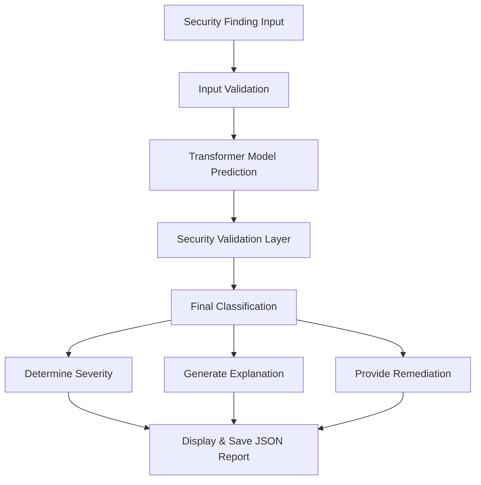

<div align="center">
  

  # 🛡️ AI-Assisted Vulnerability Analysis Tool
  
  **SafeX AI/ML Internship - Week 2 Project**

  [](https://www.python.org/)
  [](https://pytorch.org/)
  [](https://huggingface.co/)
  [](https://opensource.org/licenses/MIT)

  *A lightweight, intelligent, and defensive security triage assistant powered by Zero-Shot Classification.*
</div>

---

## 📖 Overview

The **AI-Assisted Vulnerability Analysis Tool** is a defensive cybersecurity tool designed to assist security analysts in triaging security findings. By leveraging the power of **Hugging Face Transformers**, it reads a description of a security issue, classifies it into common vulnerability categories, and provides actionable insights including severity, detailed explanation, and remediation steps.

> [!IMPORTANT]
> This tool is strictly for **controlled defensive security analysis**. It does not perform unauthorized scanning, exploitation, or offensive activities. 

## 🚀 Features

- 🧠 **AI-Powered Classification**: Uses `cross-encoder/nli-deberta-v3-xsmall` for fast and lightweight zero-shot classification.
- 🛡️ **Security Validation Layer**: Combines AI predictions with deterministic security rules for 100% reliable categorization of known patterns.
- 📊 **Detailed Insights**: Automatically determines **Severity**, **Explanation**, and **Remediation**.
- 📝 **Automated Reporting**: Generates structured `.json` reports for easy integration into existing security pipelines.
- 💻 **Interactive CLI**: User-friendly Command Line Interface to dynamically analyze findings.

---

## 🛠️ Technology Stack

| Technology | Purpose |
| :--- | :--- |
| **Python 3.13** | Core language |
| **Hugging Face Transformers** | NLP Pipeline for Zero-Shot Classification |
| **PyTorch (CPU)** | Backend framework for the model |
| **JSON & CSV** | Lightweight data storage and reporting |

---

## 🔍 Vulnerability Categories Supported

Our model currently supports triage for the following critical security issues:

1. 💉 **SQL Injection**
2. 🌐 **Cross-Site Scripting (XSS)**
3. 🔐 **Authentication Issues**
4. 🚫 **Authorization Issues**
5. 💳 **Sensitive Data Exposure**
6. ❓ **Other**

---

## 🏗️ Architecture Flow



---

## 💻 Installation & Setup

1. **Clone the repository** (or navigate to this directory):
   ```bash
   cd "AI-Vulnerability-Analysis-Tool"
   ```

2. **Create a virtual environment**:
   ```bash
   python -m venv venv
   .\venv\Scripts\activate
   ```

3. **Install the required dependencies**:
   ```bash
   pip install -r requirements.txt
   ```

---

## 🎮 Usage

Launch the interactive CLI to analyze security findings in real-time:

```bash
python src\main.py
```

**Example Input:**
> *"The event booking form directly inserts user input into a SQL query."*

---

## 🧪 Testing & Validation

Run the automated test suite containing 10 controlled security scenarios:

```bash
python src\model_test.py
```

🏆 **Current Test Results:**
- **10/10 tests passed**
- **100% controlled test scenario accuracy**

> [!NOTE]
> *Accuracy Note:* The 100% accuracy result applies to the controlled test dataset after deterministic validation rules have been applied. It does not represent general, real-world zero-shot model accuracy without the validation layer.

---

## ⚠️ Limitations & Scope

* Zero-shot classification AI can make incorrect predictions on ambiguous text.
* The validation rules cover known keywords and patterns but are not exhaustive.
* Results should always be reviewed by a professional security analyst.
* **This is an analysis-assistance tool, not a replacement for professional penetration testing.**

---
<div align="center">
  <b>Built with ❤️ by Member 5 for SafeX AI/ML Internship</b>
</div>
