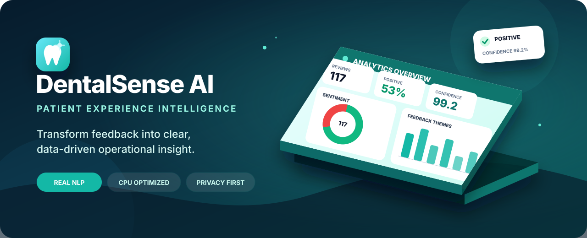
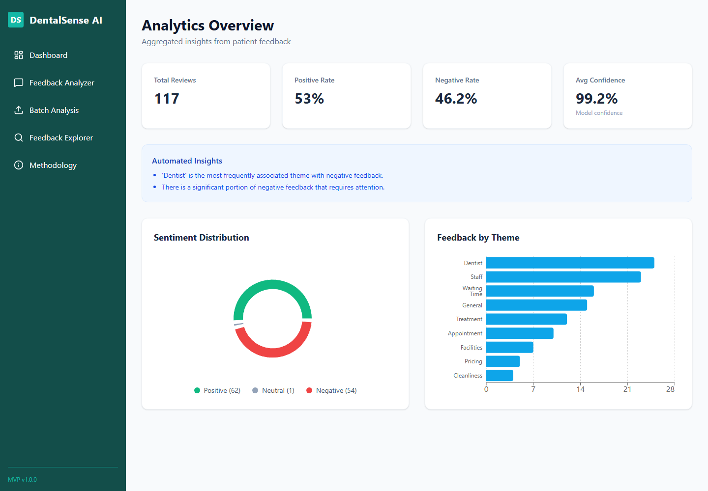
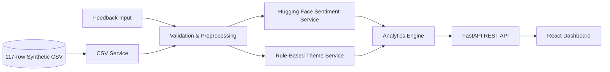

<div align="center">
  

  <br />

  # DentalSense AI

  **SafeX AI/ML Internship · Week 3 Project**

  *A local-first sentiment and feedback intelligence platform for boutique dental clinics.*

  <p>
    <a href="#-quick-start"><strong>Quick Start</strong></a> ·
    <a href="#-product-tour"><strong>Product Tour</strong></a> ·
    <a href="#-api-reference"><strong>API</strong></a> ·
    <a href="#-testing"><strong>Testing</strong></a> ·
    <a href="docs/AI_MODEL_CARD.md"><strong>Model Card</strong></a>
  </p>

  [](https://www.python.org/)
  [](https://fastapi.tiangolo.com/)
  [](https://huggingface.co/distilbert/distilbert-base-uncased-finetuned-sst-2-english)
  [](https://react.dev/)
  [](https://pytorch.org/)
  [](#-testing)
</div>

---

## 🦷 Overview

**DentalSense AI** converts unstructured clinic feedback into clear operational intelligence. It performs real local sentiment inference, identifies explainable feedback themes, aggregates trends, and presents the results through a responsive React dashboard.

> [!IMPORTANT]
> This repository uses **synthetic demonstration data only**. DentalSense AI is a business analytics project—not a diagnostic, treatment, emergency, or clinical decision-making system. It does not claim HIPAA compliance or healthcare certification.

### The problem

Dental clinics receive feedback through review sites, forms, and messages. Reading, scoring, and categorizing every response manually is slow and subjective, making recurring issues such as long waits, confusing pricing, or appointment friction easy to miss.

### The solution

DentalSense AI provides a reproducible pipeline for:

- analyzing an individual review in seconds;
- processing validated CSV batches;
- measuring sentiment and model confidence;
- assigning transparent operational themes;
- surfacing sentiment distribution and negative-feedback hotspots;
- exploring analyzed feedback with search and filters; and
- generating evidence-based insights from the selected data.

---

## ✨ Core Capabilities

| Capability | What it delivers |
| :--- | :--- |
| **Individual Analyzer** | Sentiment, confidence, theme, and timestamp for one feedback entry |
| **CSV Batch Analysis** | Type, size, schema, date, feedback, and duplicate-ID handling for bulk input |
| **Real Transformer Inference** | Local CPU inference with `distilbert-base-uncased-finetuned-sst-2-english` |
| **Explainable Theme Layer** | Keyword/rule-based classification across nine operational themes |
| **Dynamic Analytics** | Review totals, sentiment rates, confidence, themes, negative themes, and monthly series |
| **Automated Insights** | Claims derived only from calculated review statistics |
| **Feedback Explorer** | Text search plus sentiment and theme filters with compact badges |
| **Safe UX States** | Loading, empty, validation, and user-friendly error states |
| **Automatic Demo Seeding** | Loads the bundled 117-record synthetic dataset when the backend starts |

### Supported themes

`Staff` · `Dentist` · `Waiting Time` · `Treatment` · `Cleanliness` · `Pricing` · `Appointment` · `Facilities` · `General`

---

## 🖥️ Product Tour

<div align="center">
  
  <br />
  <sub><b>Analytics dashboard:</b> dynamically calculated KPIs, sentiment distribution, theme frequency, and automated insights.</sub>
</div>

| Page | Purpose |
| :--- | :--- |
| **Dashboard** | Review KPIs, sentiment distribution, theme counts, and generated insights |
| **Feedback Analyzer** | Analyze one feedback entry with visible loading and error handling |
| **Batch Analysis** | Upload and process a CSV, then review the calculated batch summary |
| **Feedback Explorer** | Search and filter analyzed reviews by sentiment and theme |
| **Methodology** | Explain model behavior, neutral logic, theme rules, privacy, and limitations |

---

## 🧠 AI Methodology

### Sentiment analysis

The application uses Hugging Face Transformers with:

```text
distilbert-base-uncased-finetuned-sst-2-english
```

- The model runs locally through a reusable Transformers pipeline.
- CPU execution is explicitly selected for accessible hardware.
- The service loads the model **once during FastAPI startup**, not once per request.
- Long input is truncated before inference to remain within the model context limit.
- Reported confidence is the model score—not a guarantee of correctness.

### Neutral classification—transparent by design

SST-2 natively predicts only `POSITIVE` or `NEGATIVE`. DentalSense AI does **not** claim that the model was trained with a third neutral class. Instead, the application applies a documented heuristic:

```text
model confidence < 0.75 → Neutral
otherwise               → model label
```

### Theme detection

> **Sentiment analysis uses Hugging Face Transformers. Theme detection uses an explainable rule-based classification layer.**

Themes are assigned using auditable keyword dictionaries. For example, `receptionist` maps to **Staff**, while `wait` maps to **Waiting Time**. The service is isolated so it can later be replaced by an aspect classifier without changing the API contract.

Read the complete [AI Model Card](docs/AI_MODEL_CARD.md) and [Limitations](docs/LIMITATIONS.md).

---

## 🏗️ Architecture



| Layer | Technologies | Responsibility |
| :--- | :--- | :--- |
| **Frontend** | React, Vite, Tailwind CSS, Recharts, Axios | Navigation, forms, charts, tables, loading/error states |
| **API** | FastAPI, Pydantic, Uvicorn | Typed endpoints, CORS, request handling, startup lifecycle |
| **AI/NLP** | Transformers, PyTorch CPU | Reusable DistilBERT sentiment inference |
| **Processing** | Pandas, Python services | CSV parsing, theme detection, aggregation, insights |
| **Data** | Synthetic CSV + in-memory state | Lightweight portfolio/demo storage without database overhead |

Detailed diagrams and component notes are available in [docs/ARCHITECTURE.md](docs/ARCHITECTURE.md).

---

## 🛠️ Technology Stack

| Area | Tools |
| :--- | :--- |
| **AI / NLP** | Hugging Face Transformers, DistilBERT SST-2 |
| **Backend** | Python, FastAPI, Pydantic, Pandas, Uvicorn |
| **Inference** | PyTorch CPU |
| **Frontend** | React, Vite, JavaScript, Tailwind CSS |
| **Visualization** | Recharts, Lucide React |
| **Testing** | Pytest, FastAPI TestClient |

---

## 📦 Dataset

The bundled [`data/sample_feedback.csv`](data/sample_feedback.csv) contains **117 fully synthetic records** spanning June–September 2026. It includes positive, negative, mixed, short, and longer reviews across all supported themes.

Required CSV schema:

```csv
id,date,feedback
1,2026-08-01,"The dentist explained the procedure very clearly."
2,2026-08-02,"The waiting time was much longer than expected."
```

Regenerate it deterministically with:

```powershell
python data\generate_dataset.py
```

No row represents a real person, appointment, or medical record.

---

## 🚀 Quick Start

### Prerequisites

- Python 3.10+
- Node.js and npm
- Internet access on the first backend run so Hugging Face can download/cache the model
- Approximately 1 GB of free memory during local inference

### 1. Clone and enter the project

```powershell
git clone https://github.com/asifnawaz23/safex-ai-ml-internship.git
cd "safex-ai-ml-internship\WEEK 3\DentalSense-AI"
```

### 2. Start the backend

```powershell
cd backend
python -m venv .venv
.\.venv\Scripts\Activate.ps1
python -m pip install -r requirements.txt
python -m uvicorn main:app --reload
```

Backend: `http://127.0.0.1:8000`  
Interactive API docs: `http://127.0.0.1:8000/docs`

> Startup loads the sentiment model once and analyzes the bundled synthetic dataset, so the dashboard is populated without a manual upload.

### 3. Start the frontend

Open a second PowerShell terminal:

```powershell
cd "safex-ai-ml-internship\WEEK 3\DentalSense-AI\frontend"
npm install
npm run dev
```

Frontend: `http://localhost:5173`

---

## 🔌 API Reference

| Method | Endpoint | Description |
| :---: | :--- | :--- |
| `GET` | `/health` | Service health and identity |
| `POST` | `/api/analyze` | Analyze one feedback string |
| `POST` | `/api/analyze/batch` | Validate and analyze a CSV file (maximum 5 MB) |
| `GET` | `/api/analytics` | Return dynamically calculated analytics and insights |
| `GET` | `/api/feedback` | Return analyzed feedback currently held in memory |
| `GET` | `/api/themes` | Return the supported theme list |

Example request:

```powershell
Invoke-RestMethod `
  -Uri "http://127.0.0.1:8000/api/analyze" `
  -Method Post `
  -ContentType "application/json" `
  -Body '{"feedback":"The dentist explained everything clearly."}'
```

Example response shape:

```json
{
  "id": null,
  "date": null,
  "feedback": "The dentist explained everything clearly.",
  "sentiment": "Positive",
  "confidence": 99.0,
  "theme": "Dentist",
  "analyzed_at": "2026-09-28T10:44:24.316777"
}
```

The confidence above illustrates the response format; live values always come from actual model inference.

---

## 🧪 Testing

Backend tests exercise the health endpoint, individual analysis, empty and whitespace validation, and rule-based theme detection.

```powershell
cd backend
.\.venv\Scripts\python.exe -m pytest -v
```

Frontend quality checks:

```powershell
cd frontend
npm run lint
npm run build
```

See [docs/TESTING.md](docs/TESTING.md) for the validation scope and manual QA record.

---

## 🔐 Privacy & Responsible Use

- All bundled feedback is synthetic and anonymized demonstration content.
- No real names, contact details, addresses, identifiers, or medical records are included.
- Uploaded content is parsed as data and never executed.
- CSV uploads are restricted by extension, structure, and a 5 MB size limit.
- The application does not provide diagnosis, treatment recommendations, clinical decisions, or emergency advice.
- This portfolio project makes no HIPAA or healthcare certification claim.

Read the complete [Privacy Statement](docs/PRIVACY.md).

---

## ⚠️ Limitations

1. The sentiment model is general-purpose and not specifically trained on dental reviews.
2. It primarily supports English text.
3. Neutral is an application heuristic, not a native SST-2 label.
4. Theme detection is lexical and cannot fully understand context or multiple competing aspects.
5. Mixed, sarcastic, or domain-specific feedback may be misclassified.
6. Confidence represents model certainty within its learned distribution—not factual correctness.
7. Storage is in-memory; an uploaded batch replaces the current dataset until restart.
8. Synthetic data does not represent real clinic populations or outcomes.

---

## 🗺️ Future Improvements

- Multi-label aspect-based sentiment analysis
- Optional SQLite persistence and saved analysis sessions
- Date-range filtering across dashboard analytics
- Downloadable analyzed CSV reports
- Authentication and role-based clinic workspaces
- Frontend component and end-to-end testing
- Lazy-loaded routes for a smaller production bundle

---

## 📚 Documentation

| Document | Purpose |
| :--- | :--- |
| [Product Requirements](docs/PRD.md) | Product goals, users, requirements, and success criteria |
| [Scope](docs/SCOPE.md) | In-scope and explicitly excluded capabilities |
| [Architecture](docs/ARCHITECTURE.md) | System flow, layers, and service responsibilities |
| [AI Model Card](docs/AI_MODEL_CARD.md) | Model intent, outputs, limitations, and neutral logic |
| [Testing](docs/TESTING.md) | Automated checks and manual QA coverage |
| [Privacy](docs/PRIVACY.md) | Synthetic-data and non-clinical-use boundaries |
| [Limitations](docs/LIMITATIONS.md) | Honest technical and domain constraints |
| [User Guide](docs/USER_GUIDE.md) | Non-technical operating instructions |
| [Professional Research](docs/PROFESSIONAL_RESEARCH.md) | Product and dashboard research references |
| [Development Plan](docs/DEVELOPMENT_PLAN.md) | Delivery phases and implementation decisions |
| [Changelog](docs/CHANGELOG.md) | Project evolution through v1.0 |

---

## 📁 Project Structure

```text
DentalSense-AI/
├── backend/
│   ├── api/                  # FastAPI routes
│   ├── models/               # Pydantic response/request schemas
│   ├── services/             # Sentiment, theme, CSV, analytics
│   ├── main.py               # App lifecycle and CORS
│   ├── test_main.py          # Backend test suite
│   └── requirements.txt
├── data/
│   ├── generate_dataset.py
│   └── sample_feedback.csv   # 117 synthetic records
├── docs/                     # Product, AI, architecture, QA, privacy
├── frontend/
│   ├── public/
│   ├── src/
│   │   ├── pages/            # Five application pages
│   │   └── services/         # Axios API client
│   └── package.json
├── screenshots/
├── .gitignore
└── README.md
```

---

<div align="center">
  <strong>Built by Muhammad Asif Nawaz</strong><br />
  <sub>SafeX AI/ML Internship · Week 3 · Customer Feedback Intelligence</sub>
</div>
