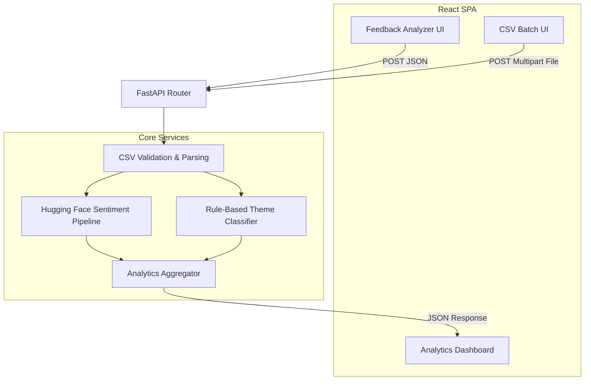

# System Architecture

DentalSense AI is designed with a clear separation of concerns, decoupling the heavy machine learning inference from the responsive frontend UI.

## High-Level Data Flow

## Component Breakdown

### 1. Frontend (Vite + React)
- **Role**: Handles all user interactions, file uploading, and data visualization.
- **Key Libraries**: `axios` for REST communication, `recharts` for SVG charting, `tailwind` for utility-first styling.
- **State Management**: React `useState` and `useEffect` hooks. Global state is mimicked by refetching from the backend upon navigation.

### 2. Backend API (FastAPI)
- **Role**: Acts as the high-performance async bridge between the UI and the ML services.
- **Endpoints**: Defined in `api/routes.py`. Enforces strict payload typing utilizing Pydantic models to prevent malformed data from crashing the inference engine.

### 3. ML Inference (Transformers)
- **Role**: Evaluates textual sentiment.
- **Strategy**: The `distilbert-base-uncased-finetuned-sst-2-english` model is initialized *once* during application startup. This prevents the severe latency spike of loading the 250MB+ weights into RAM on every POST request.

### 4. Data Service (Pandas)
- **Role**: Securely parses and sanitizes CSV uploads.
- **Strategy**: Operates on `BytesIO` streams to avoid unnecessary disk I/O. Drops missing values and normalizes date formats before passing to the AI layer.
