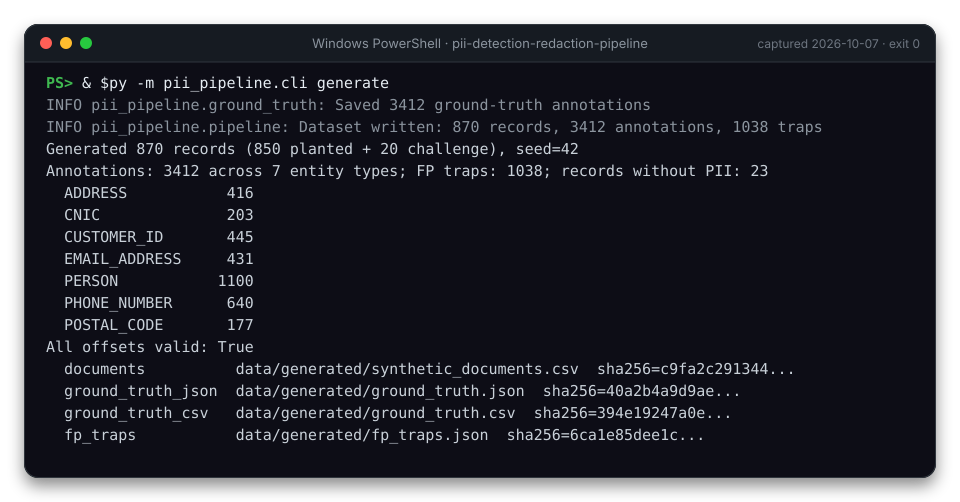
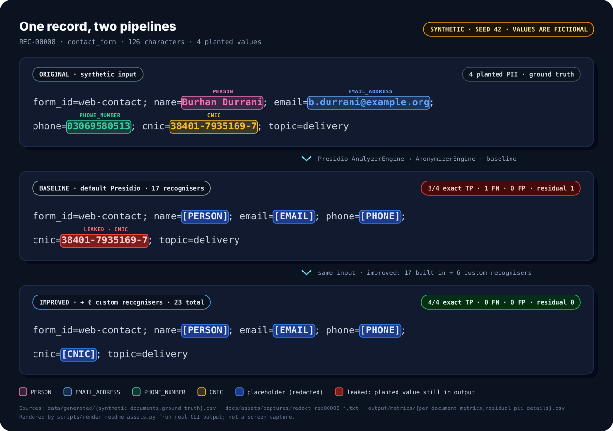
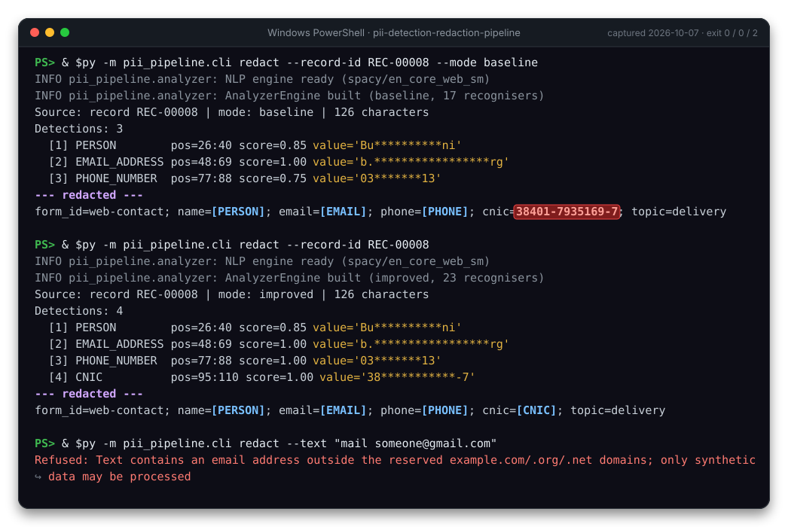
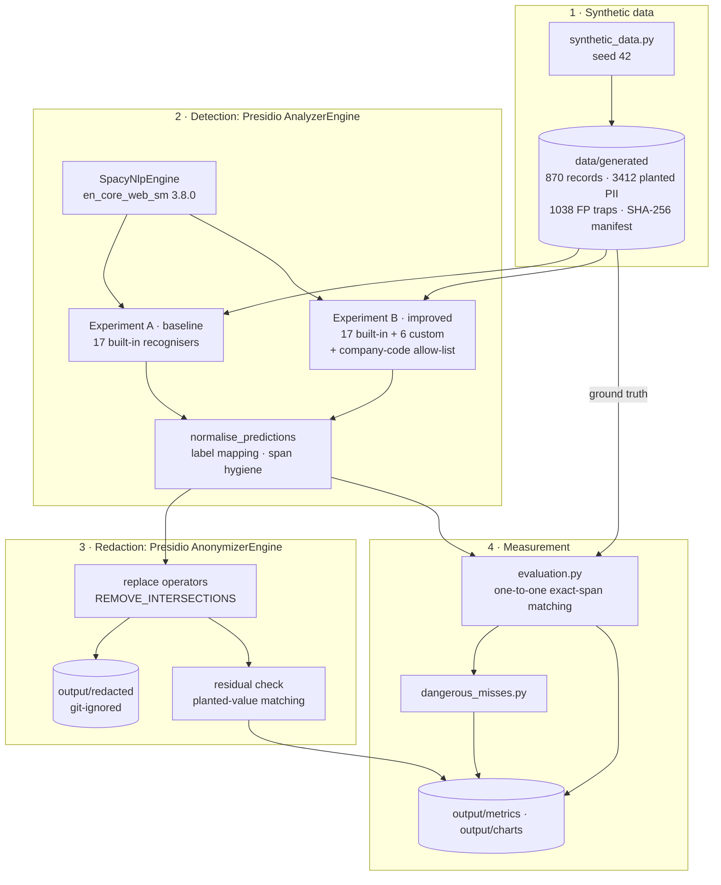
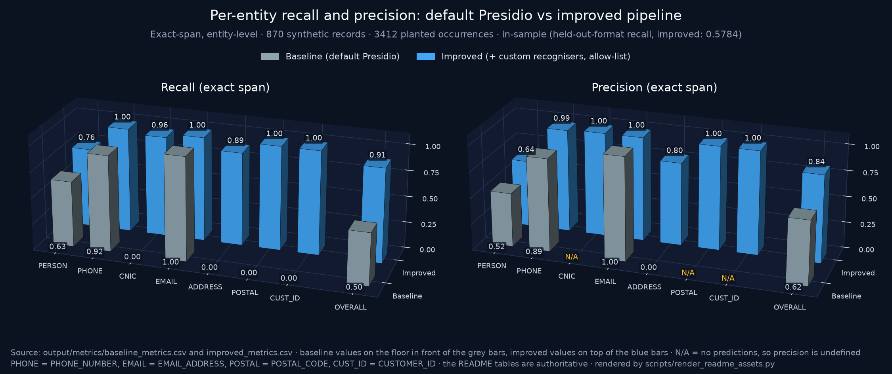
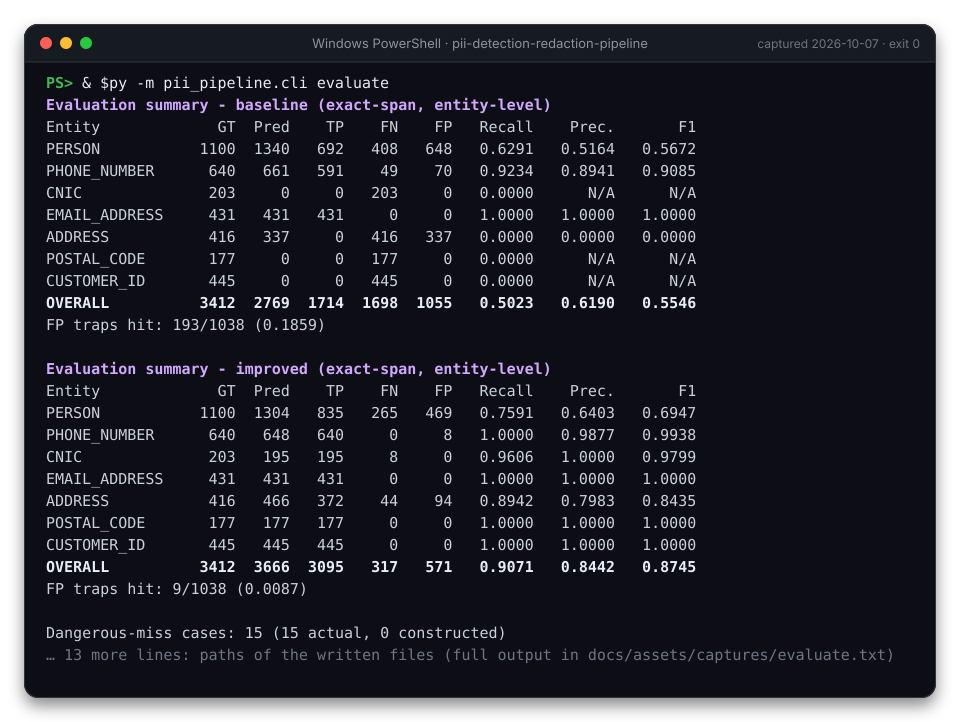
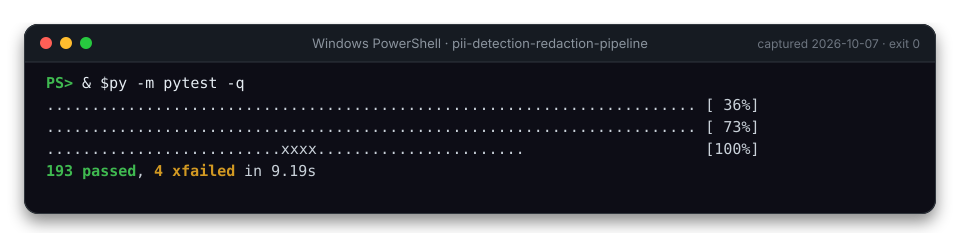

<div align="center">

<picture>
  <source media="(prefers-color-scheme: light)" srcset="docs/assets/pii-pipeline-hero-light.svg" />
  <source media="(prefers-color-scheme: dark)" srcset="docs/assets/pii-pipeline-hero.svg" />
  
</picture>

# PII Detection & Redaction Pipeline

**with measured recall and a privacy policy for the Urban Bottled Water Company (fictional)**

<sub>SafeX AI/ML Internship · Week 4 · Member 5 · Microsoft Presidio · Python · synthetic data only</sub>

<br/>

[](#technology-stack)
[](#technology-stack)
[](#technology-stack)
[](#testing)
[](LICENSE)

<p>
  <a href="#quick-start-on-windows"><b>Quick start</b></a> ·
  <a href="#how-it-works"><b>How it works</b></a> ·
  <a href="#results"><b>Results</b></a> ·
  <a href="#dangerous-misses-and-fixes"><b>Dangerous misses</b></a> ·
  <a href="docs/PRIVACY_POLICY.md"><b>Privacy policy</b></a> ·
  <a href="#limitations"><b>Limitations</b></a>
</p>

<p>
  <sub><b>Internship projects:</b>
  <a href="../../Day-01/README.md">Day 1 · Iris classification</a> ·
  <a href="../../WEEK%201/AI_Fintech_Support_Chatbot_Member5_FINAL/ai_fintech_support_chatbot_member5_final/README.md">Week 1 · FinAssist AI</a> ·
  <a href="../../WEEK%202/AI-Vulnerability-Analysis-Tool/README.md">Week 2 · Vulnerability analysis</a> ·
  <a href="../../WEEK%203/DentalSense-AI/README.md">Week 3 · DentalSense AI</a> ·
  <b>Week 4 · PII redaction (this project)</b></sub>
</p>

</div>

> [!IMPORTANT]
> All data is synthetic (seed 42; emails only on `example.com/.org/.net`). Scores are in-sample on generator formats. This is a local prototype: it makes no legal-compliance claim and does not guarantee zero residual PII.

## At a glance

<table>
  <tr>
    <td align="center" width="33%"><sub>OVERALL RECALL</sub><br/><b>0.5023 → 0.9071</b><br/><sub>exact span · 3412 planted occurrences</sub></td>
    <td align="center" width="33%"><sub>OVERALL PRECISION</sub><br/><b>0.6190 → 0.8442</b><br/><sub>F1 0.5546 → 0.8745</sub></td>
    <td align="center" width="33%"><sub>RESIDUAL DIRECT-IDENTIFIER RATE</sub><br/><b>0.1962 → 0.0063</b><br/><sub>phone, CNIC, email left after redaction</sub></td>
  </tr>
  <tr>
    <td align="center"><sub>CNIC RECALL</sub><br/><b>0.0000 → 0.9606</b><br/><sub>203 CNICs · no default recogniser</sub></td>
    <td align="center"><sub>FP-TRAP HIT RATE</sub><br/><b>0.1859 → 0.0087</b><br/><sub>193 → 9 of 1038 look-alikes</sub></td>
    <td align="center"><sub>TESTS</sub><br/><b>193 passed · 4 xfailed</b><br/><sub>local run · 0 failed · 0 skipped</sub></td>
  </tr>
</table>

Baseline is default Presidio; improved adds six custom recognisers and a company-code allow-list on the same NLP engine, threshold and post-processing. 870 synthetic records. These are in-sample scores: on held-out formats improved recall is 0.5784, and 308 of 3412 planted occurrences are still not fully redacted. See [Limitations](#limitations).

**What this project demonstrates**

- Default Presidio misses Pakistan-specific identifiers completely: CNIC, postal-code and customer-ID recall are 0.0000.
- Six custom recognisers and an allow-list raise overall exact-span recall from 0.5023 to 0.9071 and precision from 0.6190 to 0.8442.
- The remaining risk is measured, not hidden: 15 real dangerous misses were investigated (10 fixed with regression tests, 5 not fixed by design and pinned by tests).

## Contents

| Overview | Results | Run it | Engineering and governance |
|---|---|---|---|
| [The problem](#the-problem)<br>[Business context](#business-context)<br>[Scope](#scope)<br>[How it works](#how-it-works)<br>[Architecture](#architecture) | [Metric definitions](#metric-definitions)<br>[Results](#results)<br>[Key findings](#key-findings)<br>[Dangerous misses and fixes](#dangerous-misses-and-fixes)<br>[Limitations](#limitations) | [Quick start on Windows](#quick-start-on-windows)<br>[Commands](#commands)<br>[Testing](#testing)<br>[Generated artifacts](#generated-artifacts)<br>[Reproducibility](#reproducibility) | [Engineering decisions](#engineering-decisions)<br>[Technology stack](#technology-stack)<br>[Repository structure](#repository-structure)<br>[Privacy policy summary](#privacy-policy-summary)<br>[Future improvements](#future-improvements)<br>[Evidence and peer review](#evidence-and-peer-review)<br>[Video walkthrough](#video-walkthrough)<br>[Documentation](#documentation)<br>[License](#license)<br>[Author](#author) |

## The problem

Automated redaction is only useful if you know how often it fails. One missed CNIC or phone number in a shared file is a full disclosure for that person. This project does not stop at running a PII tool: it plants known PII in realistic documents, scores every detection against independent ground truth, and investigates the misses that would cause the most harm.

## Business context

The Urban Bottled Water Company (fictional) handles these document types:

- delivery orders and delivery notes
- contact forms
- subscription records
- customer-service messages
- internal operational notes

These documents contain names, Pakistani mobile numbers, CNICs, emails, addresses, postal codes and account ids. Before they go to analytics, testing or AI-assisted processing, the personal data must be removed.

## Scope

| Class | Entity types | Placeholder used in redacted text |
|---|---|---|
| Direct identifiers | `PERSON`, `PHONE_NUMBER`, `CNIC`, `EMAIL_ADDRESS`, `ADDRESS` | `[PERSON]` `[PHONE]` `[CNIC]` `[EMAIL]` `[ADDRESS]` |
| Contextual identifiers | `POSTAL_CODE`, `CUSTOMER_ID` | `[POSTAL_CODE]` `[CUSTOMER_ID]` |

Out of scope: real data, production deployment, and claims of legal compliance or guaranteed anonymity. The success criteria and numeric targets were recorded before the evaluation was run: [docs/SCOPE_STATEMENT.md](docs/SCOPE_STATEMENT.md).

## How it works

One synthetic record, end to end. Every value is fictional and was generated with seed 42.

**Step 1: Generate.** The ground truth is recorded while the text is built, never taken from detector output. Record `REC-00008`, verbatim from `data/generated/synthetic_documents.csv`:

```text
form_id=web-contact; name=Burhan Durrani; email=b.durrani@example.org; phone=03069580513; cnic=38401-7935169-7; topic=delivery
```

Its four annotations in `data/generated/ground_truth.csv` (spans are 0-based and end-exclusive):

| Annotation | Entity | Span | Edge-case tag |
|---|---|---|---|
| REC-00008-E01 | PERSON | 26:40 | — |
| REC-00008-E02 | EMAIL_ADDRESS | 48:69 | — |
| REC-00008-E03 | PHONE_NUMBER | 77:88 | phone_local_plain |
| REC-00008-E04 | CNIC | 95:110 | cnic_hyphen |

<details>
<summary><b>Captured terminal output: generate</b></summary>

<p align="center"></p>

<sub>Rendered from real CLI output by <code>scripts/render_readme_assets.py</code> (raw capture in <code>docs/assets/captures/</code>). It is not a screen capture.</sub>

</details>

**Steps 2 to 5: Analyze, anonymize, verify, score.** The same record through both pipelines:

| Step | Baseline (Experiment A) | Improved (Experiment B) |
|---|---|---|
| 2. `AnalyzerEngine` detections | 3: PERSON, EMAIL_ADDRESS, PHONE_NUMBER | 4: the same plus CNIC |
| 3. `AnonymizerEngine` output | `… phone=[PHONE]; cnic=38401-7935169-7; …` | `… phone=[PHONE]; cnic=[CNIC]; …` |
| 4. Residual check | 1 planted value still present (CNIC, exact match) | 0 |
| 5. Exact-span score | 3 TP · 1 FN · 0 FP | 4 TP · 0 FN · 0 FP |

Sources: steps 2 and 3 come from `docs/assets/captures/redact_rec00008_*.txt`, step 4 from `output/metrics/residual_pii_details.csv`, step 5 from `output/metrics/per_document_metrics.csv`.

Default Presidio has no CNIC recogniser, so the CNIC passes through untouched; the custom `PakistaniCNICRecognizer` detects it (score 1.00 in the captured output).

<p align="center">
  
</p>

<details open>
<summary><b>Captured terminal output: redact REC-00008 in both modes, then a refused input</b></summary>

<p align="center"></p>

<sub>Rendered from real CLI output by <code>scripts/render_readme_assets.py</code> (raw capture in <code>docs/assets/captures/</code>). It is not a screen capture. Detected values are masked by the CLI itself; the unredacted CNIC is fictional.</sub>

</details>

## Architecture



| Stage | Module(s) in `src/pii_pipeline/` | Output |
|---|---|---|
| 1 · Synthetic data | `synthetic_data.py` (segment builder, offsets recorded at append time), `ground_truth.py` (save, load, validate) | `data/generated/`: documents, ground truth, FP traps, manifest with SHA-256 |
| 2 · Detection | `analyzer.py` (NLP engine, two `AnalyzerEngine` configurations, `normalise_predictions`), `recognizers.py` (6 custom recognisers, allow-list), `pipeline.py` (orchestration) | `output/predictions/*_predictions.json`: spans, labels, scores, no text |
| 3 · Redaction | `redactor.py` (`AnonymizerEngine`, replace operators, conflict strategy, residual check) | `output/redacted/*.jsonl` (git-ignored), `output/predictions/*_residuals.json` |
| 4 · Measurement | `evaluation.py` (deterministic matching), `dangerous_misses.py`, `reporting.py` (CSVs, charts) | `output/metrics/*.csv`, `*.json`, `output/charts/*.png` |

`privacy.py` (guards, masking, log filter, HMAC pseudonyms), `config.py` and `cli.py` support every stage. Details: [docs/ARCHITECTURE.md](docs/ARCHITECTURE.md).

## Metric definitions

Metrics are entity-level with exact spans: start, end and label must all match; matching is one-to-one and deterministic.

| Metric | Definition |
|---|---|
| Recall | TP/(TP+FN) |
| Precision | TP/(TP+FP) |
| F1 | harmonic mean of precision and recall |

Each of these is N/A when its denominator is 0.

<details>
<summary><b>Secondary metrics</b></summary>

- **Overlap recall:** a prediction with the same label and an overlapping span also counts.
- **Redaction coverage:** the share of occurrences where every character was replaced.
- **FP-trap hit rate:** hits over the 1038 non-PII look-alikes.
- **Residual values:** planted values still present in the redacted text.
- **Not fully redacted:** occurrences that have any character left uncovered.

Full definitions: [docs/EVALUATION_REPORT.md](docs/EVALUATION_REPORT.md).

</details>

## Results

870 records, 3412 planted occurrences; baseline → improved; source `output/metrics/comparison.csv`. Targets were recorded before evaluation.

| Entity | GT | Recall | Precision | F1 | Δ recall | Target R / P | Met R / P |
|---|---|---|---|---|---|---|---|
| PERSON | 1100 | 0.6291 → 0.7591 | 0.5164 → 0.6403 | 0.5672 → 0.6947 | +0.1300 | 0.5 / 0.6 | yes / yes |
| PHONE_NUMBER | 640 | 0.9234 → 1.0000 | 0.8941 → 0.9877 | 0.9085 → 0.9938 | +0.0766 | 0.85 / 0.9 | yes / yes |
| CNIC | 203 | 0.0000 → 0.9606 | N/A → 1.0000 | N/A → 0.9799 | +0.9606 | 0.8 / 0.9 | yes / yes |
| EMAIL_ADDRESS | 431 | 1.0000 → 1.0000 | 1.0000 → 1.0000 | 1.0000 → 1.0000 | +0.0000 | 0.9 / 0.95 | yes / yes |
| ADDRESS | 416 | 0.0000 → 0.8942 | 0.0000 → 0.7983 | 0.0000 → 0.8435 | +0.8942 | 0.4 / 0.5 | yes / yes |
| POSTAL_CODE | 177 | 0.0000 → 1.0000 | N/A → 1.0000 | N/A → 1.0000 | +1.0000 | 0.6 / 0.8 | yes / yes |
| CUSTOMER_ID | 445 | 0.0000 → 1.0000 | N/A → 1.0000 | N/A → 1.0000 | +1.0000 | 0.95 / 0.95 | yes / yes |
| **OVERALL** | 3412 | 0.5023 → 0.9071 | 0.6190 → 0.8442 | 0.5546 → 0.8745 | +0.4047 | 0.75 / — | yes / — |

Overall deltas from `comparison.csv`: recall +0.4047, precision +0.2252, F1 +0.3199.

| Secondary metric | Baseline | Improved |
|---|---|---|
| Overlap recall | 0.5785 | 0.9197 |
| Redaction coverage | 0.5132 | 0.9097 |
| FP-trap hit rate | 0.1859 (193/1038) | 0.0087 (9/1038) |
| Residual planted values in the redacted text | 1244 | 236 |
| Occurrences not fully redacted | 1661 | 308 |
| Residual direct-identifier rate (phone, CNIC, email) | 0.1962 | 0.0063 |
| Runtime, 870 records (final-audit run) | 10.787 s (12.4 ms/record) | 12.081 s (13.89 ms/record) |

<p align="center"></p>
<sub>Generated by <code>scripts/render_readme_assets.py</code> from <code>output/metrics/baseline_metrics.csv</code> and <code>improved_metrics.csv</code> (cross-checked against <code>comparison.csv</code>). The 3D view is an overview with values rounded to two decimals; the tables above are the authoritative source.</sub>

<p align="center"></p>
<sub>Generated by <code>pii_pipeline.cli reports</code>.</sub>

<details>
<summary><b>Precision and recall side by side</b></summary>

<p align="center"></p>
<sub>Generated by <code>pii_pipeline.cli reports</code>.</sub>

</details>

<details>
<summary><b>Full per-entity metrics (all columns)</b></summary>

Baseline, `output/metrics/baseline_metrics.csv`:

| Entity | GT | Pred | TP | FN | FP | Recall | Precision | F1 | Partial | Wrong label | Duplicate | Overlap recall | Redaction coverage |
|---|---|---|---|---|---|---|---|---|---|---|---|---|---|
| PERSON | 1100 | 1340 | 692 | 408 | 648 | 0.6291 | 0.5164 | 0.5672 | 48 | 10 | 0 | 0.6727 | 0.6382 |
| PHONE_NUMBER | 640 | 661 | 591 | 49 | 70 | 0.9234 | 0.8941 | 0.9085 | 1 | 0 | 0 | 0.9250 | 0.9250 |
| CNIC | 203 | 0 | 0 | 203 | 0 | 0.0000 | N/A | N/A | 0 | 0 | 0 | 0.0000 | 0.0000 |
| EMAIL_ADDRESS | 431 | 431 | 431 | 0 | 0 | 1.0000 | 1.0000 | 1.0000 | 0 | 0 | 0 | 1.0000 | 1.0000 |
| ADDRESS | 416 | 337 | 0 | 416 | 337 | 0.0000 | 0.0000 | 0.0000 | 211 | 0 | 0 | 0.5072 | 0.0000 |
| POSTAL_CODE | 177 | 0 | 0 | 177 | 0 | 0.0000 | N/A | N/A | 0 | 0 | 0 | 0.0000 | 0.0113 |
| CUSTOMER_ID | 445 | 0 | 0 | 445 | 0 | 0.0000 | N/A | N/A | 0 | 23 | 0 | 0.0000 | 0.0539 |
| **OVERALL** | 3412 | 2769 | 1714 | 1698 | 1055 | 0.5023 | 0.6190 | 0.5546 | 260 | 33 | 0 | 0.5785 | 0.5132 |

Improved, `output/metrics/improved_metrics.csv`:

| Entity | GT | Pred | TP | FN | FP | Recall | Precision | F1 | Partial | Wrong label | Duplicate | Overlap recall | Redaction coverage |
|---|---|---|---|---|---|---|---|---|---|---|---|---|---|
| PERSON | 1100 | 1304 | 835 | 265 | 469 | 0.7591 | 0.6403 | 0.6947 | 30 | 9 | 0 | 0.7864 | 0.7673 |
| PHONE_NUMBER | 640 | 648 | 640 | 0 | 8 | 1.0000 | 0.9877 | 0.9938 | 0 | 0 | 0 | 1.0000 | 1.0000 |
| CNIC | 203 | 195 | 195 | 8 | 0 | 0.9606 | 1.0000 | 0.9799 | 0 | 0 | 0 | 0.9606 | 0.9606 |
| EMAIL_ADDRESS | 431 | 431 | 431 | 0 | 0 | 1.0000 | 1.0000 | 1.0000 | 0 | 0 | 0 | 1.0000 | 1.0000 |
| ADDRESS | 416 | 466 | 372 | 44 | 94 | 0.8942 | 0.7983 | 0.8435 | 13 | 0 | 2 | 0.9255 | 0.8942 |
| POSTAL_CODE | 177 | 177 | 177 | 0 | 0 | 1.0000 | 1.0000 | 1.0000 | 0 | 0 | 0 | 1.0000 | 1.0000 |
| CUSTOMER_ID | 445 | 445 | 445 | 0 | 0 | 1.0000 | 1.0000 | 1.0000 | 0 | 0 | 0 | 1.0000 | 1.0000 |
| **OVERALL** | 3412 | 3666 | 3095 | 317 | 571 | 0.9071 | 0.8442 | 0.8745 | 43 | 9 | 2 | 0.9197 | 0.9097 |

</details>

<details>
<summary><b>Results by document type</b></summary>

Baseline → improved, `output/metrics/doc_type_metrics.csv`:

| Document type | GT | Recall | Precision | Redaction coverage |
|---|---|---|---|---|
| contact_form | 525 | 0.6857 → 0.9714 | 0.9231 → 0.9533 | 0.6914 → 0.9752 |
| customer_service_message | 544 | 0.7371 → 0.9577 | 0.9548 → 0.9720 | 0.7482 → 0.9577 |
| delivery_note | 573 | 0.5044 → 0.8534 | 0.4537 → 0.7925 | 0.5131 → 0.8604 |
| delivery_order | 577 | 0.4159 → 0.9237 | 0.4089 → 0.7331 | 0.4246 → 0.9289 |
| internal_operational_note | 535 | 0.3701 → 0.8262 | 0.6972 → 0.9076 | 0.3794 → 0.8262 |
| subscription_record | 658 | 0.3435 → 0.9119 | 0.5011 → 0.7853 | 0.3632 → 0.9119 |

</details>

<details>
<summary><b>Selected edge cases</b></summary>

Exact-span recall per edge-case tag, `output/metrics/edge_case_metrics.csv`:

| Edge-case tag | GT | Recall (baseline → improved) |
|---|---|---|
| `heldout_format` | 102 | 0.3922 → 0.5784 |
| `cnic_plain` | 62 | 0.0000 → 0.8710 |
| `no_context` | 18 | 0.0000 → 0.5556 |
| `phone_local_plain` | 101 | 0.8020 → 1.0000 |
| `unicode_context` | 53 | 0.7547 → 0.9434 |
| `three_token_name` | 95 | 0.5263 → 0.6947 |
| `lowercase_name` | 43 | 0.1395 → 0.1395 |
| `uppercase_name` | 46 | 0.1087 → 0.1087 |
| `addr_landmark` | 43 | 0.0000 → 0.0000 |
| `repeated_value` | 48 | 0.8333 → 0.8333 |

</details>

<details>
<summary><b>Runtime</b></summary>

Runtime depends on machine load. Four runs (three consecutive review runs plus the final-audit run) measured baseline 10.8–15.5 s and improved 12.1–12.8 s. One earlier run recorded 735.7 s for baseline during a transient slowdown, with unchanged code.

</details>

<details>
<summary><b>Captured terminal output: evaluate</b></summary>

<p align="center"></p>

<sub>Rendered from real CLI output by <code>scripts/render_readme_assets.py</code> (raw capture in <code>docs/assets/captures/</code>). It is not a screen capture. The last 13 lines (paths of the written files) are summarised in the image and kept in full in <code>evaluate.txt</code>.</sub>

</details>

## Key findings

1. **Missing default recognisers.** Default Presidio has no recogniser for CNICs, Pakistani postal codes or company IDs, so their baseline recall is 0.0000. Its spaCy LOCATION spans never match a full street address. ADDRESS exact recall is 0.0000, while overlap recall is 0.5072.
2. **Built-in phone detection is close, not complete.** The built-in phone recogniser already reaches 0.9234 recall on Pakistani numbers. The custom patterns close the gap to 1.0000, including dot-separated and 4-3-4 formats.
3. **Names are the weakest type.** Lower-case names have 0.1395 recall and ALL-CAPS names 0.1087, in both modes. Unlabelled names in prose are missed by `en_core_web_sm`.
4. **The scores are optimistic.** The recognisers were written knowing the generator's formats. On `heldout_format` occurrences, improved recall is 0.5784 (baseline 0.3922). All 43 landmark-style addresses are missed.
5. **The FP-trap improvement is mostly the allow-list.** The `ORD-`, `BATCH-` and vehicle-plate kinds account for 184 of the 193 baseline hits. The uncovered kinds, date (4) and order_digits (5), are unchanged.
6. **Value matching under-reports leaks.** In improved mode, 308 occurrences are not fully redacted, and 78 of them (ADDRESS 38, PERSON 40) are not caught by value matching.
7. **Document type matters.** Improved recall is lowest on internal operational notes (0.8262) and delivery notes (0.8534), and highest on contact forms (0.9714).

## Dangerous misses and fixes

- **Summary.** 15 actual misses from the first full run were reviewed; 0 constructed cases were needed. 10 are `DETECTED_AFTER_FIX`, each with a regression test in `tests/test_regression.py`. 5 are `NOT_FIXED_BY_DESIGN`: one trade-off test plus four strict `xfail` tests (DM-009 to DM-012), so any change in behaviour fails the suite.
- **Before and after.** Between the initial and final runs, improved FN went 456 → 317 and FP 921 → 571 (`output/metrics/initial/improved_metrics_initial.csv` vs `improved_metrics.csv`). Shared span hygiene also raised baseline recall from 0.4678 to 0.5023, so the baseline was not left on the old code.

<details>
<summary><b>All 15 cases</b></summary>

From `output/metrics/dangerous_misses.csv`. Masked excerpts and root causes are in [docs/DANGEROUS_MISSES.md](docs/DANGEROUS_MISSES.md).

| Case | Entity | Diagnosis | Proposed fix (from the CSV) | Status | Regression test |
|---|---|---|---|---|---|
| DM-001 | CNIC | `cnic_plain_missed` | Label-anchored plain CNIC pattern (lookbehind on CNIC/NIC/National ID/NADRA ID/Identity No.), score 0.70. | DETECTED_AFTER_FIX | `test_dm_cnic_label_glued_to_number` |
| DM-002 | CNIC | `cnic_plain_no_context` | Not fixed: lowering the score would turn barcodes into CNIC detections. Mitigation: human review of documents with long digit runs; a reviewer-facing flag for unlabelled 13-digit numbers is future work. | NOT_FIXED_BY_DESIGN | `test_dm_cnic_plain_no_context_documented_tradeoff` |
| DM-003 | CNIC | `cnic_space_separated` | Add a space-separated 5-7-1 pattern (score 0.80). | DETECTED_AFTER_FIX | `test_dm_cnic_space_separated` |
| DM-004 | PHONE_NUMBER | `phone_dot_separated` | Allow '.' as the local separator. | DETECTED_AFTER_FIX | `test_dm_phone_dot_separated` |
| DM-005 | PHONE_NUMBER | `phone_local_4_3_4` | Add a 4-3-4 local pattern (score 0.80). | DETECTED_AFTER_FIX | `test_dm_phone_4_3_4` |
| DM-006 | PHONE_NUMBER | `phone_partial` | Same-label containment precedence: custom recogniser span wins over a built-in one. | DETECTED_AFTER_FIX | `test_dm_phone_custom_span_precedence` |
| DM-007 | EMAIL_ADDRESS | `email_partial` | Span hygiene: drop a leading 'key=' from EMAIL_ADDRESS spans (both modes). | DETECTED_AFTER_FIX | `test_dm_email_field_key_prefix_trimmed` |
| DM-008 | EMAIL_ADDRESS | `email_uppercase_partial` | Span hygiene: drop a leading 'key=' from EMAIL_ADDRESS spans (both modes). | DETECTED_AFTER_FIX | `test_dm_email_field_key_prefix_trimmed` |
| DM-009 | PERSON | `person_lowercase_name_missed` | Not fixed: a name gazetteer would also match ordinary words and would be fitted to the generator's name list. Human review required. | NOT_FIXED_BY_DESIGN | `test_dm_person_lowercase_name_expected_miss` |
| DM-010 | PERSON | `person_missed` | Not fixed in this prototype: needs a stronger NER model or more context patterns. | NOT_FIXED_BY_DESIGN | `test_dm_person_unlabelled_in_prose_expected_miss` |
| DM-011 | PERSON | `person_three_token_name_missed` | Not fixed: a signature pattern ('- Name Name') is possible but risks FPs on capitalised phrases; stronger NER preferred. | NOT_FIXED_BY_DESIGN | `test_dm_person_three_token_signature_expected_miss` |
| DM-012 | PERSON | `person_uppercase_name_missed` | Not fixed: an upper-case variant would match headings such as 'DELIVERY NOTE'. Human review required. | NOT_FIXED_BY_DESIGN | `test_dm_person_uppercase_name_expected_miss` |
| DM-013 | PERSON | `person_lowercase_name_partial` | Span hygiene: end PERSON spans at field delimiters, line breaks and digits. | DETECTED_AFTER_FIX | `test_dm_person_span_cut_at_field_delimiter` |
| DM-014 | PERSON | `person_no_whitespace_partial` | Span hygiene: end PERSON spans at field delimiters, line breaks and digits. | DETECTED_AFTER_FIX | `test_dm_person_span_cut_at_field_delimiter` |
| DM-015 | PERSON | `person_partial` | Span hygiene: strip leading form labels/titles from PERSON spans. | DETECTED_AFTER_FIX | `test_dm_person_leading_label_trimmed` |

</details>

## Limitations

- **In-sample, optimistic scores.** Recognisers and the allow-list were written knowing the generator's formats. Held-out-format recall (improved) is 0.5784.
- **Names.** Lower-case 0.1395 and ALL-CAPS 0.1087 recall. Unlabelled names in prose are missed. Landmark-style addresses: 0.0000 (43 occurrences).
- **Unlabelled CNICs.** 8 unlabelled 13-digit CNICs are missed. This is a deliberate trade-off: none of the 22 barcode traps is flagged.
- **No zero-residual guarantee.** 308 planted occurrences are not fully redacted in improved mode, and 255 of the 847 PII-bearing records keep at least one uncovered PII character. Residual checks only cover planted values.
- **FP-trap rate is optimistic.** The rate depends on an allow-list that matches the generator's own code formats.
- **Synthetic data only.** The synthetic-only guard is a tripwire, not proof.
- **Small model.** Only the small English NER model (`en_core_web_sm`) is used.
- **Tested environment.** Tested only on Windows 11 with Python 3.13.5. A from-scratch install into a brand-new venv was not repeated in the final audit (`pip check` was clean).
- **No access control.** There is no authentication, audit logging or encryption at rest; this is a local CLI prototype.
- **Not a compliance tool.** The privacy policy is a proposed prototype.

Full list: [docs/LIMITATIONS.md](docs/LIMITATIONS.md).

## Quick start on Windows

Prerequisites:

- Python 3.13 (3.13.5 verified)
- About 442 MB for the venv
- Internet only for `pip install`, which fetches the packages and the 12.8 MB `en_core_web_sm` wheel. The pipeline itself makes no network calls.
- No GPU, Docker or paid API

```powershell
# 1. Get the code (the project lives inside the internship repository)
git clone https://github.com/asifnawaz23/safex-ai-ml-internship.git
cd "safex-ai-ml-internship\WEEK 4\pii-detection-redaction-pipeline"

# 2. Virtual environment: no activation needed, which avoids execution-policy prompts
python --version
python -m venv .venv
$py = ".\.venv\Scripts\python.exe"

# 3. Pinned dependencies, including the en_core_web_sm 3.8.0 wheel (sha256-pinned)
& $py -m pip install -r requirements.txt
$env:PYTHONPATH = "src"                   # once per PowerShell session

# 4. Run everything, then the tests
& $py -m pii_pipeline.cli all             # generate -> baseline -> improved -> evaluate -> reports
& $py -m pytest -q
```

> [!NOTE]
> Re-running `baseline`/`improved` changes only the runtime figures in `experiment_summary.csv`, `summary.json` and `*_engine.json`. If the model is missing, the pipeline stops with an error instead of downloading the ~500 MB `en_core_web_lg`.

## Commands

| Step | Command (`$py` and `PYTHONPATH` as above) | Writes | Verified |
|---|---|---|---|
| Generate dataset | `& $py -m pii_pipeline.cli generate` (defaults `--seed 42 --count 850`) | `data/generated/` | final audit; re-run byte-identically for the README captures |
| Baseline (Experiment A) | `& $py -m pii_pipeline.cli baseline` | `output/predictions/`, `output/redacted/`, `output/metrics/baseline_engine.json` | final audit |
| Improved (Experiment B) | `& $py -m pii_pipeline.cli improved` | same, for `improved` | final audit |
| Evaluate both modes | `& $py -m pii_pipeline.cli evaluate` | `output/metrics/*.csv`, `*.json` | final audit; re-run byte-identically for the README captures |
| Charts | `& $py -m pii_pipeline.cli reports` | `output/charts/*.png` | final audit |
| Everything | `& $py -m pii_pipeline.cli all` | all of the above | earlier review runs; not as a single command in the final audit |
| Tests | `& $py -m pytest -q` or `& $py -m pii_pipeline.cli test` | nothing in the repo | final audit; again on 2026-10-07 for the README |
| Redact one document | see below | stdout, or `output/redacted/` with `--output` | final audit |
| README assets | `& $py scripts\render_readme_assets.py` (`--capture` re-runs the read-only commands first) | `docs/assets/` | 2026-10-07 |

Redaction commands:

```powershell
& $py -m pii_pipeline.cli redact --record-id REC-00008
& $py -m pii_pipeline.cli redact --text "Call 0321-1234567 or mail a.b12@example.org" --dry-run
& $py -m pii_pipeline.cli redact --file data\my_synthetic.txt --output output\redacted\out.txt
```

<details>
<summary><b>Redaction options, safeguards and exit codes</b></summary>

- `--mode baseline|improved` selects the experiment; the default is `improved`.
- `--dry-run` prints masked detections only.
- `--file` must be inside `data/`, and `--output` must be inside `output/redacted/`.
- Exit codes are 0 for success, 1 for an error and 2 when a safeguard refuses the input. For example, an email domain other than `example.*` is refused with exit code 2.
- Redaction uses `AnonymizerEngine` with one `replace` operator per label and `REMOVE_INTERSECTIONS`, so overlapping detections leave no original characters behind.

</details>

<details>
<summary><b>Wrapper scripts (no <code>PYTHONPATH</code> needed)</b></summary>

```powershell
& $py scripts\generate_dataset.py
& $py scripts\run_baseline.py
& $py scripts\run_improved_pipeline.py
& $py scripts\evaluate.py
& $py scripts\build_reports.py
```

`generate_dataset.py`, `evaluate.py` and `build_reports.py` were run in the final audit and exited 0. `run_baseline.py` and `run_improved_pipeline.py` were not re-run there, so the recorded runtimes stay in sync with the docs.

</details>

## Testing

197 collected: 193 passed, 4 xfailed (strict), 0 failed, 0 skipped. Local run on Windows 11, Python 3.13.5; there is no CI.

The four strict xfails pin the not-fixed name misses DM-009 to DM-012, so an XPASS fails the suite.

<p align="center"></p>

<sub>Rendered from real CLI output by <code>scripts/render_readme_assets.py</code> (raw capture in <code>docs/assets/captures/</code>). It is not a screen capture.</sub>

<details>
<summary><b>Test files</b></summary>

| File | Test functions | What it covers |
|---|---|---|
| `tests/test_evaluation.py` | 15 | exact, partial, wrong-label and duplicate matching; one prediction per GT; N/A on zero denominators; hand-computed P/R/F1; trap hit rate; partial-leak counting |
| `tests/test_integration.py` | 5 | both modes end to end: every record processed, engine metadata, improved beats baseline on local identifiers, fewer residuals, report columns |
| `tests/test_privacy.py` | 22 | no planted values in logs, log masking, path guards, synthetic-only guard, HMAC pseudonyms, no network calls, CLI refusals |
| `tests/test_recognizers.py` | 24 | Pakistani phone and CNIC positives and negatives, email, labelled person, address, postal code, customer ID |
| `tests/test_redaction.py` | 23 | placeholder per label, overlapping and nested spans, repeated values, Urdu and accented text, idempotency, residual check |
| `tests/test_regression.py` | 19 | prototype bugs D1 to D5, dangerous-miss fixes, the four strict xfails, company-code allow-list |
| `tests/test_synthetic_data.py` | 22 | at least 800 unique records, span integrity, entity and document-type coverage, edge cases and traps, reserved email domains, seed determinism, file hashes |

These are function counts; parametrisation expands them to 197 collected tests. Details: [docs/TESTING_AND_VALIDATION.md](docs/TESTING_AND_VALIDATION.md).

</details>

## Generated artifacts

<details>
<summary><b>Artifact table</b></summary>

| Path | Content |
|---|---|
| `output/metrics/baseline_metrics.csv`, `improved_metrics.csv` | per-type and overall metrics |
| `output/metrics/comparison.csv` | baseline vs improved, deltas, targets met |
| `output/metrics/per_document_metrics.csv` | per record and mode |
| `output/metrics/doc_type_metrics.csv`, `edge_case_metrics.csv` | by document type and edge-case tag |
| `output/metrics/fp_trap_report.csv` | FP-trap hits by kind |
| `output/metrics/residual_pii_report.csv`, `residual_pii_details.csv` | PII left after redaction (masked values) |
| `output/metrics/dangerous_misses.csv`, `.json` | 15 reviewed misses |
| `output/metrics/experiment_summary.csv`, `summary.json`, `*_engine.json` | runtime, dataset, engine metadata |
| `output/metrics/initial/` | snapshot before the dangerous-miss fixes |
| `output/charts/recall_by_entity.png`, `precision_recall_comparison.png` | charts |
| `output/predictions/`, `output/redacted/` | predictions (no text) and redacted documents |
| `docs/assets/` | README visuals, generated by `scripts/render_readme_assets.py` |
| `docs/assets/captures/` | raw captured command output and `manifest.json` (command, exit code, date) |

</details>

## Reproducibility

Everything is seeded with seed 42, and the dataset file hashes are recorded in `data/generated/dataset_manifest.json`. Two consecutive `all` runs produced byte-identical files for:

- all of `data/generated/`
- `output/predictions/`, `output/redacted/` and both charts
- every metric CSV/JSON except the four runtime-bearing files: `experiment_summary.csv`, `summary.json`, `baseline_engine.json` and `improved_engine.json`

README visuals rebuild byte-identically from the committed CSVs and captures with `& $py scripts\render_readme_assets.py`.

## Engineering decisions

| Decision | Why | Consequence / trade-off |
|---|---|---|
| Ground truth recorded while documents are built | Detector output never shapes the labels | Generator formats are known, so scores are in-sample |
| Exact span is the primary metric | A lenient metric cannot hide boundary errors | Harsher numbers: baseline ADDRESS exact 0.0000 vs overlap 0.5072 |
| Same NLP engine, threshold 0.35 and post-processing in both modes | The baseline is not sandbagged | Span-hygiene fixes also lifted the baseline (0.4678 → 0.5023) |
| `en_core_web_sm` pinned by URL + sha256; no silent `en_core_web_lg` download | Fits the 8 GB RAM and disk budget; reproducible installs | Weaker NER: name recall gaps |
| Unlabelled 13-digit numbers stay below threshold (0.30 < 0.35) | Barcodes are not redacted as CNICs (0 of 22 barcode traps hit) | 8 unlabelled CNICs missed |
| Custom span precedence + `REMOVE_INTERSECTIONS` | Deterministic redaction; no original characters left by overlaps | In same-label containment, the built-in span is dropped in favour of the custom one (DM-006) |
| HMAC-SHA256 pseudonyms (`PII_PIPELINE_HMAC_KEY`) | Plain hashes of phones and CNICs can be brute-forced | The key must be protected like the data; a pseudonym is not anonymisation |
| Company-code allow-list (improved only) | Removes `ORD-`/`BATCH-`/plate false positives | Makes the FP-trap gain optimistic (184 of 193 baseline hits) |
| Local only: no network client in `src/`; offline `tldextract` snapshot | No document leaves the machine | Tests cover the exercised paths; not a formal proof |
| Safeguards: `synthetic=true`, `example.*` emails, path limits, exit code 2 | Fail closed on suspicious input | Refuses some legitimate inputs by design |

## Technology stack

These versions are pinned in `requirements.txt` and were verified on Windows 11 with Python 3.13.5.

| Package | Version | Use |
|---|---|---|
| Python | 3.13.5 | runtime (verified) |
| presidio-analyzer | 2.2.364 | detection, custom `PatternRecognizer`s |
| presidio-anonymizer | 2.2.364 | `replace` operators, conflict resolution |
| spacy | 3.8.16 | NLP engine |
| en_core_web_sm | 3.8.0 (pinned wheel + sha256) | small English NER model |
| pandas | 2.3.3 | metric tables |
| matplotlib | 3.11.2 | charts, including the `mplot3d` README chart |
| pytest | 8.4.2 | tests |

Python's standard library (`random`, `json`, `csv`, `logging`, `hashlib`, `hmac`, `re`) covers the generator, I/O, logging and pseudonyms. Presidio itself depends on `regex`, `phonenumbers` and `tldextract`, which pip installs automatically.

## Repository structure

<details>
<summary><b>Directory tree</b></summary>

```
pii-detection-redaction-pipeline/
├── README.md  CHANGELOG.md  LICENSE  requirements.txt  pytest.ini  .gitignore  .env.example
├── config/settings.json        entity lists, label mapping, placeholders, targets, paths
├── src/pii_pipeline/           config, synthetic_data, ground_truth, recognizers, analyzer,
│                               redactor, evaluation, dangerous_misses, privacy, pipeline,
│                               reporting, cli
├── scripts/                    generate_dataset, run_baseline, run_improved_pipeline,
│                               evaluate, build_reports, render_readme_assets
├── tests/                      7 test files, 197 collected tests
├── data/generated/             synthetic dataset (see data/README.md)
├── output/metrics/             evaluation CSV/JSON (initial/ = before fixes)
├── output/charts/              recall_by_entity.png, precision_recall_comparison.png
├── output/predictions/         spans, labels, scores (no text)
├── output/redacted/            redacted text (git-ignored)
├── docs/                       scope, architecture, privacy policy, evaluation, misses,
│   │                           testing, limitations, learning notes, video plan, peer review
│   └── assets/                 README visuals; captures/ = raw captured CLI output + manifest
└── evidence/                   screenshot checklist; screenshots/ (to be captured)
```

</details>

## Privacy policy summary

- **Local processing:** everything runs locally, and `tldextract` is forced onto its offline snapshot.
- **Synthetic-only guard:** the pipeline requires the `synthetic=true` column and only accepts `example.*` email domains.
- **Logging:** no raw text is logged, and a masking filter adds a second line of defence.
- **Separate storage:** originals, annotations and redacted output live in separate trees.
- **Retention and access control:** a proposed schedule covers both.
- **Pseudonyms:** HMAC-SHA256 with a key from `PII_PIPELINE_HMAC_KEY`. Plain hashes of phones and CNICs are brute-forceable.
- **Incident response:** a seven-step procedure.

The policy is a prototype and makes no compliance claim. No pipeline guarantees zero residual PII. Full policy: [docs/PRIVACY_POLICY.md](docs/PRIVACY_POLICY.md).

## Future improvements

- Evaluate on a second, independently written generator, or on a governed real-style corpus, for an out-of-sample estimate.
- Try a stronger NER model (e.g. `en_core_web_md`) if disk and RAM allow, and measure the cost.
- Add a reviewer flag for unlabelled 13-digit numbers and capitalised tokens near contact fields, instead of auto-redacting them.
- Add landmark-address patterns, evaluated on held-out phrasing.
- Run seed-variance runs to get confidence intervals.

## Evidence and peer review

| Item | Status | Where |
|---|---|---|
| Evidence screenshots (13) | **PENDING**: not captured yet | [evidence/README.md](evidence/README.md) lists each screenshot and its command |
| Classmate peer review | **PENDING**: not done yet; no reviewer, date or feedback recorded | [docs/PEER_REVIEW.md](docs/PEER_REVIEW.md) |

The terminal images in this README are rendered from captured command output; they are not evidence screenshots.

## Video walkthrough

**Status: PENDING.** The author records it; the plan and script are in [docs/VIDEO_WALKTHROUGH.md](docs/VIDEO_WALKTHROUGH.md). No link exists yet.

## Documentation

| Document | Purpose |
|---|---|
| [docs/SCOPE_STATEMENT.md](docs/SCOPE_STATEMENT.md) | business context, entity classes, success criteria, targets and their history |
| [docs/ARCHITECTURE.md](docs/ARCHITECTURE.md) | stages, modules, experiments, custom recognisers, design decisions |
| [docs/PRIVACY_POLICY.md](docs/PRIVACY_POLICY.md) | proposed handling policy: retention, access, pseudonyms, incident response |
| [docs/EVALUATION_REPORT.md](docs/EVALUATION_REPORT.md) | operational metric definitions, results by entity, document type and edge case, FP traps, residuals, initial vs final run |
| [docs/DANGEROUS_MISSES.md](docs/DANGEROUS_MISSES.md) | the 15 reviewed misses with masked excerpts, root causes and fixes |
| [docs/PROJECT_SUMMARY.md](docs/PROJECT_SUMMARY.md) | one-page summary |
| [docs/TESTING_AND_VALIDATION.md](docs/TESTING_AND_VALIDATION.md) | test runs, results and checks not performed |
| [docs/LIMITATIONS.md](docs/LIMITATIONS.md) | full limitations list |
| [docs/LEARNING_NOTES.md](docs/LEARNING_NOTES.md) | concepts, learning plan, verification checklist |
| [docs/PEER_REVIEW.md](docs/PEER_REVIEW.md) | peer-review template and checklist (PENDING) |
| [docs/VIDEO_WALKTHROUGH.md](docs/VIDEO_WALKTHROUGH.md) | video plan and script (PENDING) |
| [data/README.md](data/README.md) | dataset files and schema |
| [evidence/README.md](evidence/README.md) | checklist of the 13 evidence screenshots |
| [CHANGELOG.md](CHANGELOG.md) | every change with its reason and verification |

## License

MIT. See [LICENSE](LICENSE).

## Author

<div align="center">

<strong>Built by Muhammad Asif Nawaz</strong><br/>
<sub>SafeX AI/ML Internship · Week 4 · Privacy engineering · Member 5, individual contributor</sub><br/><br/>
<a href="https://github.com/asifnawaz23">github.com/asifnawaz23</a>

</div>
