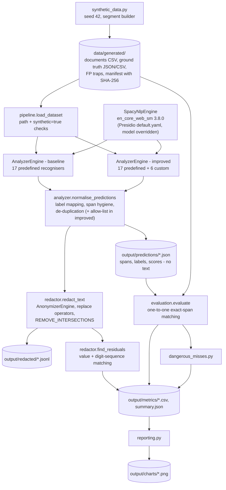

# Architecture

The pipeline has five stages: **generate → analyse → normalise → redact → evaluate**.

- It runs locally from a CLI (`python -m pii_pipeline.cli`) or from the wrapper scripts in `scripts/`.
- Both experiments use the same dataset, NLP engine, threshold and post-processing. Experiment B adds custom recognisers and a company-code allow-list.

## Modules (`src/pii_pipeline/`)

| Module | Role |
|---|---|
| `config.py` | Loads `config/settings.json`: entity lists, label mapping, placeholders, targets, paths and privacy settings |
| `synthetic_data.py` | Generator. Documents are assembled from segments, so every PII offset is recorded when the value is appended, not found by search afterwards. It covers 6 document types and adds FP traps and 20 challenge records. |
| `ground_truth.py` | Saves and loads the ground truth and traps as JSON/CSV. `validate_annotations` checks the offsets, ids and types, and that no trap overlaps the ground truth. |
| `recognizers.py` | The six custom `PatternRecognizer`s and the company-code allow-list regex |
| `analyzer.py` | Builds the NLP engine (refuses to auto-download a model), the two `AnalyzerEngine` configurations (cached), the offline `tldextract` guard, `normalise_predictions` and `describe_engine` |
| `redactor.py` | `AnonymizerEngine` with `replace` operators, conflict strategy and residual check |
| `evaluation.py` | `Prediction` dataclass, deterministic matching, per-type, per-document-type, per-tag and per-record metrics, trap hits and coverage |
| `pipeline.py` | Orchestration: load and validate the dataset, run an experiment, save predictions, redacted text and engine metadata |
| `dangerous_misses.py` | Selects up to 15 misses, re-checks them against the current run and writes CSV/JSON |
| `privacy.py` | Path guards, synthetic-only guard, masking, log filter, HMAC pseudonyms, dry-run preview |
| `reporting.py` | Metric CSVs and the two matplotlib charts |
| `cli.py` | Subcommands `generate`, `baseline`, `improved`, `evaluate`, `reports`, `redact`, `test` and `all`. Exit codes: 0 = ok, 1 = error, 2 = refused. |

## Experiments

| | A: baseline | B: improved |
|---|---|---|
| Registry | `RecognizerRegistry` + `load_predefined_recognizers(languages=["en"])` | the same, plus `add_recognizer` for 6 custom recognisers |
| Requested entities | PERSON, PHONE_NUMBER, EMAIL_ADDRESS, LOCATION | the same, plus CNIC, ADDRESS, POSTAL_CODE, CUSTOMER_ID |
| Threshold | 0.35 | 0.35 |
| Allow-list | no | yes (`ORD-…`, `BATCH-…`, `XXX-dddd` codes) |

Custom recognisers (all of type `PatternRecognizer`; context words feed Presidio's `LemmaContextAwareEnhancer`):

| Recogniser | Entity | Why it exists |
|---|---|---|
| `PakistaniPhoneRecognizer` | PHONE_NUMBER | The built-in `PhoneRecognizer` uses python-phonenumbers without a PK region and a fixed score of 0.4. The custom patterns cover the local `03XX`, `+92` and `0092` formats with strict boundaries. |
| `PakistaniCNICRecognizer` | CNIC | No default recogniser exists. Hyphenated CNICs score 0.90 and space-separated ones 0.80. A labelled plain number scores 0.70. An unlabelled plain number scores 0.30 and needs a context word. |
| `UBWCustomerIDRecognizer` | CUSTOMER_ID | Company-specific `UBW-ddddd` format |
| `PakistaniPostalCodeRecognizer` | POSTAL_CODE | No default recogniser exists. A bare `\d{5}` pattern was rejected because it matched invoice numbers and CNIC blocks; the code must be labelled or follow a city name. |
| `PakistaniAddressRecognizer` | ADDRESS | spaCy only emits LOCATION fragments. This pattern starts at a dwelling keyword with a number and ends at a city. Landmark addresses are not targeted on purpose. |
| `LabelledPersonRecognizer` | PERSON | `en_core_web_sm` misses many names in form fields. This pattern matches a case-sensitive 2–3 token name after a label or title. |

## Key design decisions

1. **Independent ground truth.** Offsets are recorded during construction and checked against the text afterwards. Detector output is never used to build or fix annotations.
2. **Exact span as the primary metric.** Overlap recall and redaction coverage are reported as secondary metrics, so a lenient metric cannot hide boundary errors.
3. **Single label mapping** in `settings.json`, used everywhere: `LOCATION → ADDRESS`. spaCy LOCATION is the only default address signal. The mapping is documented, and exact-span scoring keeps it honest: baseline ADDRESS exact recall is 0.0000.
4. **Shared post-processing.** Span hygiene and de-duplication run in both modes, so the baseline benefits from bug fixes too. Only the allow-list is improved-only, and its effect is disclosed in the evaluation report.
5. **Deterministic conflict handling.** Redaction uses Presidio's `REMOVE_INTERSECTIONS`: overlapping detections are trimmed so that every covered character stays replaced. Same-label nested detections are collapsed before redaction, and a custom recogniser's span takes precedence over a built-in one.
6. **Small model, no silent download.** `build_nlp_engine` loads Presidio's own `conf/default.yaml`, so its NER label mapping and ignore list are kept, and overrides only the model name. If `en_core_web_sm` is missing it raises an error instead of letting Presidio fetch `en_core_web_lg`.
7. **Local only.** No network client is imported in `src/`, and `tldextract` is forced onto its bundled snapshot. Tests check both (`tests/test_privacy.py`). These tests cover the exercised code paths; they are not a formal proof.
8. **Separated storage.** Originals and annotations live in `data/generated/` and redacted text in `output/redacted/`. `output/predictions/` holds spans without text. `save_experiment` refuses a layout in which the redacted directory sits inside the data directory.
