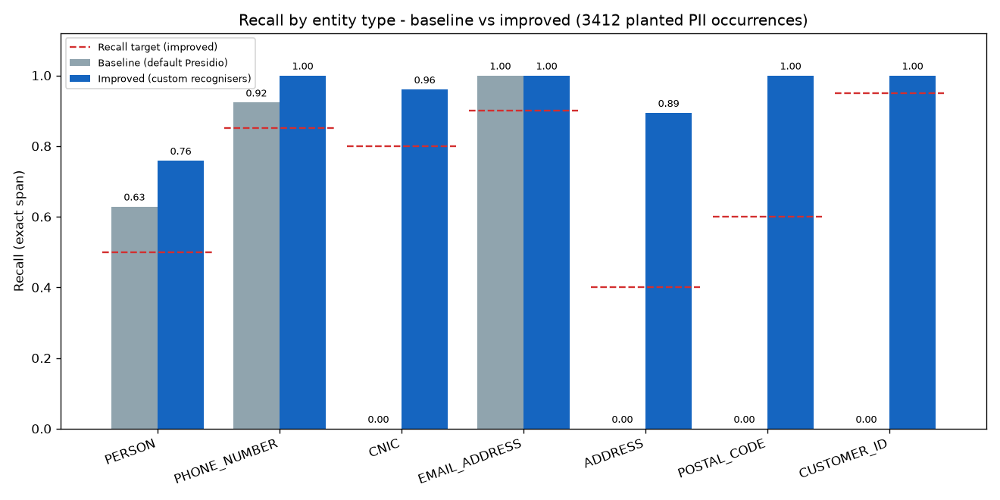
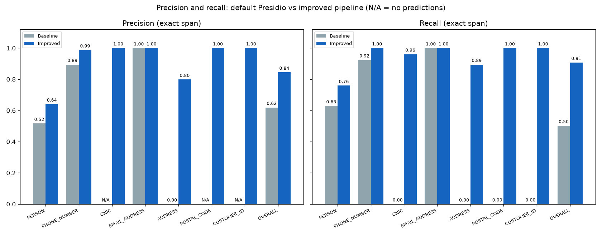

# Evaluation Report

Every number in this report is copied from files generated in the final-audit run: `generate`, `baseline`, `improved`, `evaluate` and `reports`, run one after another from a clean state (the same steps `python -m pii_pipeline.cli all` chains). The sources are in `output/metrics/`:

- `baseline_metrics.csv`, `improved_metrics.csv`, `comparison.csv`
- `doc_type_metrics.csv`, `edge_case_metrics.csv`, `fp_trap_report.csv`
- `residual_pii_report.csv`, `per_document_metrics.csv`
- `experiment_summary.csv`, `summary.json`, `*_engine.json`

The "before fixes" snapshot is in `output/metrics/initial/`. If you regenerate the artifacts, read the CSVs, not this file.

## 1. Setup

| Item | Baseline (Experiment A) | Improved (Experiment B) |
|---|---|---|
| Dataset | 870 records (850 planted + 20 challenge), seed 42 | same |
| Ground truth | 3412 planted occurrences, 7 entity types | same |
| FP traps | 1038 annotated non-PII look-alikes | same |
| Engine | Presidio `AnalyzerEngine` 2.2.364, `SpacyNlpEngine` with `en_core_web_sm` 3.8.0, spaCy 3.8.16 | same |
| Language and threshold | `en`, `score_threshold` 0.35 | same |
| Context enhancer | `LemmaContextAwareEnhancer` (Presidio default) | same |
| Recognisers | 17 predefined English recognisers from `load_predefined_recognizers` | the same 17 plus 6 custom: `PakistaniPhoneRecognizer`, `PakistaniCNICRecognizer`, `UBWCustomerIDRecognizer`, `PakistaniPostalCodeRecognizer`, `PakistaniAddressRecognizer`, `LabelledPersonRecognizer` |
| Requested entities | PERSON, PHONE_NUMBER, EMAIL_ADDRESS, LOCATION | the same plus CNIC, ADDRESS, POSTAL_CODE, CUSTOMER_ID |
| Post-processing | label mapping (`LOCATION → ADDRESS`), span hygiene, de-duplication | the same, plus the company-code allow-list |
| Redaction | `AnonymizerEngine`, one `replace` operator per label, `REMOVE_INTERSECTIONS` | same |
| Runtime (analysis + redaction) | 10.787 s, 12.4 ms/record | 12.081 s, 13.89 ms/record |

Environment: Python 3.13.5 on Windows 11 (`Windows-11-10.0.26200-SP0`), i7 8th gen, 8 GB RAM, no GPU.

Default Presidio 2.2.364 has no recogniser for CNIC, Pakistani postal codes or company customer ids. This was verified in the installed package. In the baseline these types therefore have 0 predictions. That is the measured behaviour of the default setup, not a handicap added by this project.

## 2. Metrics, defined operationally

**Unit of evaluation.** One planted PII occurrence. If the same phone number appears twice in a document, that counts as two ground-truth items, and each one needs its own prediction.

**Matching.** Matching is deterministic and one-to-one within each record (`evaluation.match_record`). The passes run in this order:

1. **Exact.** The prediction has the same start, end and label as the ground truth. This is a **TP**.
2. **Wrong label.** The span is the same but the label differs. The ground truth becomes an **FN** and the prediction an **FP**.
3. **Partial.** The label is the same and the spans overlap, but the boundaries differ. The best IoU pairs are matched first. For the primary metrics this is still **FN + FP**. It only counts towards the secondary *overlap recall*.
4. **Leftover predictions.** A prediction that overlaps an already matched prediction of the same label is a *duplicate*. Any other leftover is *spurious*. Both kinds are **FP**.
5. **Leftover ground truth.** These are *missed* and count as **FN**.

A prediction can match at most one ground-truth item. Nested ground truth (a postal code inside an address) gives two independent targets.

**Formulas.**

| Metric | Formula | When the denominator is 0 |
|---|---|---|
| Recall | TP / (TP + FN) | N/A |
| Precision | TP / (TP + FP) | N/A |
| F1 | 2·P·R / (P + R) | N/A |
| Overlap recall (secondary) | (exact + partial) / GT | N/A |

**Redaction coverage.** The share of planted occurrences where every character was covered by some prediction, of any label. A wrong-label or over-wide detection still redacts the value. That is why coverage can be higher than exact recall.

**FP-trap hit rate.** The number of annotated traps overlapped by any in-scope prediction, divided by the 1038 traps. Traps are order numbers, invoice totals, bottle counts, dates, batch codes, barcodes, tracking numbers, invoice numbers and vehicle plates.

**Residuals.** These checks look for PII that survived redaction:

- **`residual_count`.** The planted value is still present in the redacted text. The check uses the whole value with alphanumeric boundaries and ignores case. For phones and CNICs it also tries a digit sequence with any separators. It works on the redacted text, not on the original offsets.
- **`not_fully_redacted`.** The occurrence has at least one character that no prediction covered. This uses the original offsets.
- **`partial_leaks_not_value_matched`.** The occurrences that are not fully redacted but are missed by the whole-value check. An example is an address where the house number survives.

All of these are entity-level metrics. Document-level figures (Section 6) are labelled separately. Character accuracy is not used.

## 3. Results by entity type

### 3.1 Baseline (`baseline_metrics.csv`)

| Entity | GT | Pred | TP | FN | FP | Recall | Precision | F1 | Partial | Wrong label | Overlap recall | Redaction coverage |
|---|---|---|---|---|---|---|---|---|---|---|---|---|
| PERSON | 1100 | 1340 | 692 | 408 | 648 | 0.6291 | 0.5164 | 0.5672 | 48 | 10 | 0.6727 | 0.6382 |
| PHONE_NUMBER | 640 | 661 | 591 | 49 | 70 | 0.9234 | 0.8941 | 0.9085 | 1 | 0 | 0.9250 | 0.9250 |
| CNIC | 203 | 0 | 0 | 203 | 0 | 0.0000 | N/A | N/A | 0 | 0 | 0.0000 | 0.0000 |
| EMAIL_ADDRESS | 431 | 431 | 431 | 0 | 0 | 1.0000 | 1.0000 | 1.0000 | 0 | 0 | 1.0000 | 1.0000 |
| ADDRESS | 416 | 337 | 0 | 416 | 337 | 0.0000 | 0.0000 | 0.0000 | 211 | 0 | 0.5072 | 0.0000 |
| POSTAL_CODE | 177 | 0 | 0 | 177 | 0 | 0.0000 | N/A | N/A | 0 | 0 | 0.0000 | 0.0113 |
| CUSTOMER_ID | 445 | 0 | 0 | 445 | 0 | 0.0000 | N/A | N/A | 0 | 23 | 0.0000 | 0.0539 |
| **OVERALL** | 3412 | 2769 | 1714 | 1698 | 1055 | 0.5023 | 0.6190 | 0.5546 | 260 | 33 | 0.5785 | 0.5132 |

### 3.2 Improved (`improved_metrics.csv`)

| Entity | GT | Pred | TP | FN | FP | Recall | Precision | F1 | Partial | Wrong label | Duplicate | Overlap recall | Redaction coverage |
|---|---|---|---|---|---|---|---|---|---|---|---|---|---|
| PERSON | 1100 | 1304 | 835 | 265 | 469 | 0.7591 | 0.6403 | 0.6947 | 30 | 9 | 0 | 0.7864 | 0.7673 |
| PHONE_NUMBER | 640 | 648 | 640 | 0 | 8 | 1.0000 | 0.9877 | 0.9938 | 0 | 0 | 0 | 1.0000 | 1.0000 |
| CNIC | 203 | 195 | 195 | 8 | 0 | 0.9606 | 1.0000 | 0.9799 | 0 | 0 | 0 | 0.9606 | 0.9606 |
| EMAIL_ADDRESS | 431 | 431 | 431 | 0 | 0 | 1.0000 | 1.0000 | 1.0000 | 0 | 0 | 0 | 1.0000 | 1.0000 |
| ADDRESS | 416 | 466 | 372 | 44 | 94 | 0.8942 | 0.7983 | 0.8435 | 13 | 0 | 2 | 0.9255 | 0.8942 |
| POSTAL_CODE | 177 | 177 | 177 | 0 | 0 | 1.0000 | 1.0000 | 1.0000 | 0 | 0 | 0 | 1.0000 | 1.0000 |
| CUSTOMER_ID | 445 | 445 | 445 | 0 | 0 | 1.0000 | 1.0000 | 1.0000 | 0 | 0 | 0 | 1.0000 | 1.0000 |
| **OVERALL** | 3412 | 3666 | 3095 | 317 | 571 | 0.9071 | 0.8442 | 0.8745 | 43 | 9 | 2 | 0.9197 | 0.9097 |

### 3.3 Baseline vs improved (`comparison.csv`)

| Entity | Δ recall | Δ precision | Δ F1 | Recall target | Precision target | Improved meets recall target | Improved meets precision target |
|---|---|---|---|---|---|---|---|
| PERSON | +0.1300 | +0.1239 | +0.1275 | 0.5 | 0.6 | yes | yes |
| PHONE_NUMBER | +0.0766 | +0.0936 | +0.0853 | 0.85 | 0.9 | yes | yes |
| CNIC | +0.9606 | N/A | N/A | 0.8 | 0.9 | yes | yes |
| EMAIL_ADDRESS | +0.0000 | +0.0000 | +0.0000 | 0.9 | 0.95 | yes | yes |
| ADDRESS | +0.8942 | +0.7983 | +0.8435 | 0.4 | 0.5 | yes | yes |
| POSTAL_CODE | +1.0000 | N/A | N/A | 0.6 | 0.8 | yes | yes |
| CUSTOMER_ID | +1.0000 | N/A | N/A | 0.95 | 0.95 | yes | yes |
| OVERALL | +0.4047 | +0.2252 | +0.3199 | 0.75 | — | yes | — |

The deltas are N/A where the baseline precision is N/A, because it made no predictions. The overall precision target cell is empty in `comparison.csv`, because no overall precision target was set.

## 4. False positives and FP traps (`fp_trap_report.csv`)

| Trap kind | Traps | Baseline hits | Baseline rate | Improved hits | Improved rate |
|---|---|---|---|---|---|
| barcode | 22 | 0 | 0.0000 | 0 | 0.0000 |
| batch_code | 89 | 59 | 0.6629 | 0 | 0.0000 |
| bottle_count | 305 | 0 | 0.0000 | 0 | 0.0000 |
| date | 159 | 4 | 0.0252 | 4 | 0.0252 |
| invoice_number | 67 | 0 | 0.0000 | 0 | 0.0000 |
| invoice_total | 72 | 0 | 0.0000 | 0 | 0.0000 |
| order_digits | 120 | 5 | 0.0417 | 5 | 0.0417 |
| order_number | 58 | 58 | 1.0000 | 0 | 0.0000 |
| tracking_number | 22 | 0 | 0.0000 | 0 | 0.0000 |
| vehicle_plate | 124 | 67 | 0.5403 | 0 | 0.0000 |
| **ALL** | 1038 | 193 | 0.1859 | 9 | 0.0087 |

**The improved rate of 0.0087 is optimistic.** In improved mode, a company-code allow-list (`recognizers.NON_PII_CODE_REGEX`) drops detections inside `ORD-dddd-dddddd`, `BATCH-dddd-X` and `XXX-dddd` codes. These are the same formats the generator uses for its order-number, batch-code and vehicle-plate traps. Those three kinds account for 184 of the 193 baseline hits (58 + 59 + 67), and all three fall to 0 in improved mode. The trap kinds the allow-list does not cover, date (4) and order_digits (5), have identical hits in both modes. So the allow-list shows that known code formats are suppressed. It does not show that the pipeline resists false positives in general.

The baseline phone results also include a real built-in false positive. Presidio's `PhoneRecognizer` flags a plain `1234567890` (score 0.4). This is documented by `tests/test_recognizers.py::test_builtin_phone_recognizer_flags_plain_10_digits`.

The remaining improved false positives are mostly PERSON (469) and ADDRESS (94):

- **PERSON.** One cause, seen in a manual CLI run: inside a full address, spaCy also tags locality and city tokens (e.g. "Gulberg", "Lahore") as PERSON. Redaction still replaces the whole address, because `REMOVE_INTERSECTIONS` keeps every covered character replaced. For evaluation, however, these are spurious PERSON predictions.
- **ADDRESS.** Of the 94 FPs, 13 are partial matches (boundaries differ from the ground truth) and 2 are duplicates. The rest are spurious, for example spaCy LOCATION spans (mapped to ADDRESS) that are not full addresses. The CSVs do not break the spurious ones down further.

## 5. Residual PII after redaction (`residual_pii_report.csv`)

| Mode | Entity | GT | residual_count | residual_rate | not_fully_redacted | partial_leaks_not_value_matched |
|---|---|---|---|---|---|---|
| baseline | PERSON | 1100 | 344 | 0.3127 | 398 | 59 |
| baseline | PHONE_NUMBER | 640 | 48 | 0.0750 | 48 | 0 |
| baseline | CNIC | 203 | 202 | 0.9951 | 203 | 1 |
| baseline | EMAIL_ADDRESS | 431 | 0 | 0.0000 | 0 | 0 |
| baseline | ADDRESS | 416 | 69 | 0.1659 | 416 | 347 |
| baseline | POSTAL_CODE | 177 | 175 | 0.9887 | 175 | 0 |
| baseline | CUSTOMER_ID | 445 | 406 | 0.9124 | 421 | 15 |
| baseline | **OVERALL** | 3412 | 1244 | 0.3646 | 1661 | 422 |
| improved | PERSON | 1100 | 222 | 0.2018 | 256 | 40 |
| improved | PHONE_NUMBER | 640 | 0 | 0.0000 | 0 | 0 |
| improved | CNIC | 203 | 8 | 0.0394 | 8 | 0 |
| improved | EMAIL_ADDRESS | 431 | 0 | 0.0000 | 0 | 0 |
| improved | ADDRESS | 416 | 6 | 0.0144 | 44 | 38 |
| improved | POSTAL_CODE | 177 | 0 | 0.0000 | 0 | 0 |
| improved | CUSTOMER_ID | 445 | 0 | 0.0000 | 0 | 0 |
| improved | **OVERALL** | 3412 | 236 | 0.0692 | 308 | 78 |

The `digit_sequence_matches` column is 0 everywhere. So every residual was found by the whole-value check, and none survived only with changed separators.

**Residual direct identifiers.** These are PHONE_NUMBER, CNIC and EMAIL_ADDRESS (`experiment_summary.csv`, `residual_direct_identifier_rate`):

| Mode | Count | Rate |
|---|---|---|
| Baseline | 48 + 202 + 0 = 250 of 1274 | 0.1962 |
| Improved | 0 + 8 + 0 = 8 of 1274 | 0.0063 |

**Value matching under-reports leaks.** Of the improved ADDRESS occurrences, 44 were not fully redacted, but only 6 have their whole value still present. The other 38 are partial leaks, for example a house number and street that survived next to a redacted city. The baseline shows the same effect even more strongly: 416 addresses were not fully redacted, but only 69 were value-matched.

**Redaction success rate.** Redaction coverage, defined in Section 2, is 0.5132 for the baseline and 0.9097 for the improved pipeline.

## 6. Results by document type (`doc_type_metrics.csv`)

| Doc type | GT | Baseline recall | Baseline precision | Improved recall | Improved precision | Improved F1 | Improved coverage |
|---|---|---|---|---|---|---|---|
| contact_form | 525 | 0.6857 | 0.9231 | 0.9714 | 0.9533 | 0.9623 | 0.9752 |
| customer_service_message | 544 | 0.7371 | 0.9548 | 0.9577 | 0.9720 | 0.9648 | 0.9577 |
| delivery_note | 573 | 0.5044 | 0.4537 | 0.8534 | 0.7925 | 0.8218 | 0.8604 |
| delivery_order | 577 | 0.4159 | 0.4089 | 0.9237 | 0.7331 | 0.8175 | 0.9289 |
| internal_operational_note | 535 | 0.3701 | 0.6972 | 0.8262 | 0.9076 | 0.8650 | 0.8262 |
| subscription_record | 658 | 0.3435 | 0.5011 | 0.9119 | 0.7853 | 0.8439 | 0.9119 |

**Weakest recall.** Internal operational notes have the lowest improved recall (0.8262). They hold free-text prose with unlabelled names and staff signatures.

**Weakest precision.** Delivery orders (0.7331) and subscription records (0.7853) have the lowest improved precision. Their many addresses produce spurious PERSON and LOCATION spans.

**Document-level view.** These counts were computed from `per_document_metrics.csv` and only cover the 847 records that have at least one planted occurrence:

| Mode | Records with every occurrence matched exactly | Records with every occurrence fully covered by redaction |
|---|---|---|
| Baseline | 70 | 76 |
| Improved | 584 | 592 |

So entity-level recall of 0.9071 still leaves 255 of the 847 PII-bearing documents with at least one character of PII uncovered in improved mode. In the 23 records without PII, the improved pipeline produced 4 FPs in 4 records. The baseline produced 27 FPs in 18 records.

## 7. Selected edge cases (`edge_case_metrics.csv`, recall)

| Tag | GT | Baseline | Improved | Note |
|---|---|---|---|---|
| cnic_hyphen | 131 | 0.0000 | 1.0000 | |
| cnic_plain | 62 | 0.0000 | 0.8710 | 8 misses are plain CNICs without a context word |
| no_context | 18 | 0.0000 | 0.5556 | context-dependent by design |
| cnic_spaced | 10 | 0.0000 | 1.0000 | pattern added after the dangerous-miss review |
| phone_local_plain | 101 | 0.8020 | 1.0000 | |
| phone_local_space | 62 | 0.8387 | 1.0000 | |
| phone_dot_separated | 29 | 0.8276 | 1.0000 | pattern added after review |
| phone_local_4_3_4 | 20 | 0.8000 | 1.0000 | pattern added after review |
| addr_landmark | 43 | 0.0000 | 0.0000 | held-out, not targeted (overlap recall 0.2791) |
| heldout_format | 102 | 0.3922 | 0.5784 | all held-out formats together |
| lowercase_name | 43 | 0.1395 | 0.1395 | not improved |
| uppercase_name | 46 | 0.1087 | 0.1087 | not improved |
| three_token_name | 95 | 0.5263 | 0.6947 | |
| unicode_context | 53 | 0.7547 | 0.9434 | Urdu phrases in the document |
| repeated_value | 48 | 0.8333 | 0.8333 | |
| custid_lowercase | 21 | 0.0000 | 1.0000 | |

The `heldout_format` tag is the more honest generalisation signal. It covers formats the recognisers were not written for, at least before the review. Its improved recall is 0.5784, against 0.9071 overall.

## 8. Initial run vs final run (`output/metrics/initial/`)

The first full run was made before the dangerous-miss fixes. Its improved results were recorded before any change. The fixes changed recognisers and the shared post-processing only; no generator change was made.

| Metric | Initial improved | Final improved |
|---|---|---|
| Recall | 0.8664 | 0.9071 |
| Precision | 0.7624 | 0.8442 |
| F1 | 0.8111 | 0.8745 |
| FN / FP | 456 / 921 | 317 / 571 |
| FP-trap hit rate | 0.1917 (199/1038) | 0.0087 (9/1038) |
| Residual direct-identifier rate | 0.0204 | 0.0063 |

**Initial misses against the targets.** Measured against the pre-registered targets in `docs/SCOPE_STATEMENT.md`, the initial improved run missed:

- PERSON precision: 0.5197, against a target of ≥ 0.60.
- EMAIL_ADDRESS recall and precision: 0.8886 each, against targets of ≥ 0.90 and ≥ 0.95.
- FP-trap rate: 0.1917, against a target of ≤ 0.10.

The span-hygiene fix belongs to the shared post-processing, so it also changed the baseline:

| Baseline metric | Initial | Final |
|---|---|---|
| Overall recall | 0.4678 | 0.5023 |
| EMAIL_ADDRESS recall | 0.8886 | 1.0000 |
| PERSON recall | 0.5655 | 0.6291 |

The baseline was not left on the old post-processing, which would have flattered the improvement.

**Every target is met in the final run, but with a caveat.** The fixes were found by inspecting misses in this same dataset. The final numbers are therefore an in-sample result, not a held-out estimate. The targets themselves were not changed.

## 9. Poor entity types and what was done

**PERSON** has the lowest results (improved recall 0.7591, precision 0.6403).

The misses come from three kinds of names:

- lower-case names (recall 0.1395)
- ALL-CAPS names (recall 0.1087)
- unlabelled names in prose and staff signatures

`en_core_web_sm` does not tag these names. `LabelledPersonRecognizer` is case-sensitive on purpose: a case-insensitive version would match ordinary words.

The false positives come from spaCy tagging locality and city tokens as names.

Steps taken:

- a labelled-name pattern
- span hygiene: cut spans at field delimiters and digits, and strip leading labels
- strict `xfail` tests that record the remaining misses

Next steps would be a stronger NER model, if the hardware allows, or a reviewer flag for capitalised tokens near contact fields.

**ADDRESS** reaches improved recall 0.8942, precision 0.7983. It fails on landmark-style addresses, which were deliberately not targeted (recall 0.0000). It also counts LOCATION fragments as FPs. The baseline gets 0 exact matches because spaCy LOCATION spans are city or road fragments. Its overlap recall is 0.5072, but its coverage is 0.0000.

**CNIC** has 8 remaining misses, all plain 13-digit numbers without a context word. Lowering the score of the plain pattern would turn 13-digit barcodes into CNIC detections. In this run, 0 of 22 barcode traps were hit. This trade-off is recorded in `test_dm_cnic_plain_no_context_documented_tradeoff`.

## 10. Trade-offs and honest reading

- **Optimistic scores.** The recognisers and the allow-list were written by someone who knew the generator's formats. Real documents will have formats this dataset does not contain.
- **Precision gains.** These came mostly from span hygiene and the allow-list, not from better detection.
- **Runtime.** The improved pipeline is slower than the baseline by about 1.5 ms/record in this run (13.89 vs 12.4 ms/record). Wall-clock time varies with machine load: four runs (three consecutive review runs plus the final-audit run) gave baseline 10.8–15.5 s and improved 12.1–12.8 s.
- **Uncovered PII.** No configuration here guarantees zero residual PII. 308 planted occurrences were not fully covered in improved mode.
